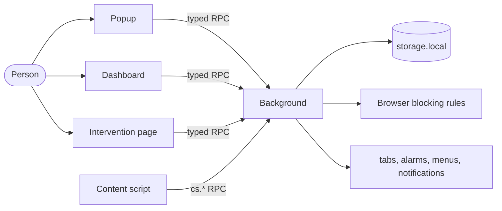

# Architecture

How WebHandbrake is built, for contributors. What it must do is in
[requirements.md](requirements.md); why it is built this way is in the [ADRs](adr/README.md).

## Context

WebHandbrake is a Manifest V3 extension built from one TypeScript code base for Chrome (service
worker), Firefox desktop and Firefox for Android (event page)
([ADR 0001](adr/0001-manifest-v3-dnr-first.md)). It talks to no server: everything it knows is in
the browser's extension storage.

## Code map

| Directory | Responsibility |
| --- | --- |
| `src/engine/` | Pure logic with no browser API: data model, matching, schedules, limits, decisions, next change, blocking-rule compiler, change classification, validation, importers. Fully unit tested. |
| `src/background/` | The single source of truth at run time: storage, time accounting, enforcement, protection, tickets, breaks, sessions, statistics, data, diagnostics. |
| `src/content/` | Content script: active-time ticks, overlay timer, filters, grace period, back/forward cache re-checks. |
| `src/popup/`, `src/dashboard/`, `src/intervention/` | The three extension pages ([design.md](design.md)). |
| `src/ui/` | Shared Preact components, styles and state tones ([ADR 0002](adr/0002-ui-preact.md)). |
| `src/shared/` | View models, typed RPC, formatting, plain-language summaries. |
| `src/i18n/`, `src/locales/` | ICU message formatting and the English source strings ([ADR 0005](adr/0005-i18n.md)). |
| `src/platform/` | Browser adapter and feature detection. |
| `src/data/` | Ready-made site lists. |
| `scripts/` | Build, manifest, packaging, checks and documentation tools. |

## Data model

The interface says *rule* and *condition*; the code keeps the model names `Group` and `Policy`
([ADR 0007](adr/0007-interface-terms.md), [glossary](glossary.md)).

- `Config` is the person's intent: groups, shared lists, **Always allowed** and settings. Every
  entity has a stable id, a revision and an update time, and deletions leave tombstones, so
  synchronisation between devices can be added without changing the model.
- `RuntimeState` is what changes over time: grants (breaks and passes), focus sessions, pending
  changes, cool-downs, activity and protection events.
- Usage is stored as daily totals per group, per site of a group and per host, plus minute buckets
  for hourly and rolling limits, kept for `MINUTE_RETENTION_MINUTES` (`src/engine/limits.ts`).

The file formats are in [data-format.md](data-format.md).

## Decisions

`src/engine/decide.ts` implements the
[evaluation semantics](requirements.md#evaluation-semantics):

1. **Always allowed** wins over everything (SEM-05).
2. Inside a group, the most specific matching entry decides; an exception beats a less specific
   block and a tie goes to the block (SEM-02, SEM-06). Exceptions never affect other groups
   (SEM-04).
3. Policies are evaluated in order; the first whose condition holds (schedule and, optionally, a
   used-up limit) gives the intervention. Cool-downs and focus sessions can raise it; breaks and
   passes can lower it.
4. Across groups the most severe intervention wins, whatever the order (SEM-03).

`src/engine/next.ts` finds when the result changes (SEM-07) by evaluating the decision at every
candidate instant (window edges, period ends, grant expiries, session ends) up to `HORIZON_DAYS`
ahead.

## Enforcement

Enforcement is layered, so each layer covers what the one before cannot see:

1. **Browser blocking rules** (`src/engine/dnr.ts`, `src/background/dnr-sync.ts`). Each distinct
   target becomes a region; the engine decides a representative address of the region, and a
   dynamic rule with a priority derived from its specificity redirects to
   `intervention.html#<original address>`. Dynamic rules apply from browser start (ENF-08).
   Without access to sites, redirects become plain blocks (ENF-12).
2. **Navigation checks** (`src/background/enforce.ts`) re-check committed navigations, history API
   changes in single-page applications, browser pages and local files.
3. **The intervention page** asks the background for the exact decision; when a blocking rule was
   broader than the engine, it lets the page through with a short-lived pass (ENF-09).
4. **Reconciliation.** When the situation changes (a window starts, a limit runs out, a break
   ends), every open tab is checked again, with a grace period while the person is typing
   (INT-13).

The content script runs on the hosts of active rules. It runs on every site when tracking of all
sites is on, when an active entry is a regular expression, or when a host wildcard is not a
leading `*.` (`contentMatchPatterns` in `src/engine/patterns.ts`,
`src/background/contentscripts.ts`).

## Time accounting

The content script sends a tick about once a second, only while the page is visible and focused
and the person is active or media plays. The background credits each usage key with the time
since that key's previous credit, capped to a few seconds, so several tabs never count twice
(TIM-03) and sleep or clock jumps never count (TIM-02). Totals are written at most every
`USAGE_FLUSH_MS`.

## Protection

A configuration change is split into small units (`src/engine/changes.ts`) and each is classified
as stricter, neutral or loosening; when a unit cannot be proven stricter, it counts as loosening
([ADR 0004](adr/0004-change-classification.md)). `src/background/protection.ts` applies stricter
units at once and routes the others by protection level: a confirmation, a wait, a cooling-off
with a typed confirmation, or a refusal. Every cost is a ticket checked in the background
(`src/background/tickets.ts`), so editing an extension page cannot skip it (PRO-14). How people
can still get around it is in the [threat model](threat-model.md).

## Persistence and reliability

Storage is the source of truth (REL-01). The configuration is written with a checksum of its
canonical JSON, and every write keeps the previous version (`RECENT_SNAPSHOTS` recent copies and
one a day for `DAILY_SNAPSHOTS` days). A configuration that fails its checksum is restored from the
latest valid copy at start (DAT-03). A schema migration keeps a copy of the original until it
succeeds (DAT-07). Unknown fields are preserved.

## Messaging

Extension pages call the background through a typed RPC (`src/shared/rpc.ts`). Content scripts can
call only the `cs.*` methods (SEC-05). Methods that change the configuration run one at a time.
After a change the background broadcasts a message so open pages refresh.

## Browser differences

| Concern | Chrome | Firefox | Firefox for Android |
| --- | --- | --- | --- |
| Background | Service worker | Event page | Event page |
| Context menu and keyboard shortcuts | Yes | Yes | No (feature-detected) |
| Minimum version | <!-- fact: manifest.chrome.min -->121<!-- /fact --> | <!-- fact: manifest.firefox.min -->140<!-- /fact --> | <!-- fact: manifest.android.min -->142<!-- /fact --> |

The two manifests come from `scripts/manifest.mjs` (COMP-02); why these versions is in
[ADR 0010](adr/0010-minimum-browser-versions.md).

## Build

`scripts/build.mjs` bundles each entry point with esbuild into `dist/chrome` and `dist/firefox`;
`--test` builds `dist-test/` with a test clock and test entry points that the production build
leaves out. The production build is reproducible ([ADR 0011](adr/0011-auditable-build.md),
[releasing.md](releasing.md)). Tests are described in [testing.md](testing.md).
