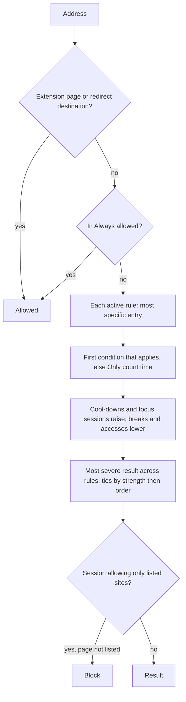

# Requirements

What WebHandbrake does, one item per requirement ID, each with its status and the way it is
verified. The [traceability matrix](traceability.md) lists the tests behind each item. The
[glossary](glossary.md) maps the interface terms used here to their names in the code: a rule is a
`Group`, a condition is a `Policy`, a limit is a `Budget` and a break is a pause `Grant`.

## Purpose and scope

WebHandbrake is a browser extension that limits, slows down or blocks the websites a person
chooses, on schedules and time limits they set, with friction in graduated steps rather than a
single wall ([vision](principles.md#vision)). A rule can cover whole sites, single hosts, sections
of a site, single pages, the home page, addresses with given query parameters and embedded
content. WebHandbrake does not remove elements inside a page, and it does not match keywords,
referrers or categories of sites: those are [planned requirements](#planned-requirements).
Everything runs and is stored on the device.

## How to read this document

Each requirement is one list item:

```text
- <a id="pro-15"></a>**PRO-15 Emergency exit** · implemented · e2e
  The statement of what WebHandbrake does.
  Note: what is missing or how it is verified, when the status or the verification needs it.
```

- **Status.**
  - `implemented`: it exists and is verified as declared.
  - `partial`: it exists with gaps, which the Note names.
  - `unverified`: it exists, but the declared verification (a device, a study, a measurement or a
    manual check) has not been done; the Note says what is missing.
  - `planned`: it does not exist. Planned items carry a priority (Must, Should or Could) instead of
    a verification, and the [roadmap](roadmap.md) discusses some of them.
  - `withdrawn`: the ID is retired and stays reserved.
- **Verification**, one or more of:
  - `unit`: a unit test whose title cites the ID;
  - `e2e`: an end-to-end test, run in Chromium and Firefox, whose title cites the ID;
  - `manual`: a check listed in [the manual checks](testing.md#manual-checks);
  - `ci`: an automated check that is not a test, named in the Note;
  - `review`: code inspection of the function or file the Note names;
  - `study`: a user study or a measurement.
- **IDs** have the form `AREA-NN` and are never renumbered or reused. A new requirement takes the
  next number in its area; a retired one moves to [Withdrawn IDs](#withdrawn-ids). Every ID has
  its own item, so that it has its own anchor (`#pro-15`).
- A test title cites an ID only when the test checks that item's statement. Code comments cite IDs
  as plain text. Circumvention routes have CIR IDs, defined in the [threat model](threat-model.md).
- Numbers that the code owns are read from the code when the documents are generated
  (`npm run docs`), or named by their constant and file. Interface labels are in bold.

## Constraints

- <a id="vin-01"></a>**VIN-01 Open source** · implemented · review
  WebHandbrake is free and open-source software, developed in public on GitHub.
  Note: the licence is GPL-3.0-or-later (`LICENSE`, [ADR 0003](adr/0003-license.md)).
- <a id="vin-02"></a>**VIN-02 Local-first** · implemented · review
  All data stays on the device. There is no account and no server of the project.
  Note: data is kept only in the extension's storage areas ([PRIV-02](#priv-02)).
- <a id="vin-03"></a>**VIN-03 No telemetry** · implemented · review
  WebHandbrake collects no telemetry and makes no network request that the person did not start.
  Note: verified through [PRIV-01](#priv-01), which an end-to-end test checks.
- <a id="vin-04"></a>**VIN-04 One code base** · implemented · ci
  One code base serves Firefox on the desktop, Firefox for Android and Chromium-based browsers.
  Note: `scripts/manifest.mjs` builds the Chrome and Firefox manifests from the same sources; checks
  on Android devices are [COMP-03](#comp-03).
- <a id="vin-05"></a>**VIN-05 No sync** · implemented · review
  WebHandbrake does not synchronise data between devices.
  Note: no code under `src/` uses `storage.sync`.

## Out of scope

- Blocking native apps or other browsers. An extension cannot reach them.
- Parental control as the main use. It assumes an administrator who is not the user, a different
  threat model.
- Accounts, servers or cloud services of the project ([VIN-02](#vin-02)).
- Selling or sharing data, advertising and upselling ([ETH-01](#eth-01)).
- Competitive gamification, such as leaderboards.
- Safari.
- Filtering DNS or the network of the whole system.
- Syncing between devices ([VIN-05](#vin-05)).

## Evaluation semantics

How WebHandbrake decides what happens to an address at a given moment. The engine is
`decide()` in `src/engine/decide.ts`.

- <a id="sem-01"></a>**SEM-01 Severity order** · implemented · review
  Interventions are ordered by severity, as the [Severity](#severity) table lists. Redirect is as
  severe as Block, and Close the tab is the most severe.
  Note: the order is `SEVERITY` in `src/engine/decide.ts`.
- <a id="sem-02"></a>**SEM-02 Precedence inside a rule** · implemented · unit, e2e
  Inside a rule, the most specific matching entry decides whether the rule applies to an address
  ([SEM-06](#sem-06)); on equal specificity a blocking entry wins over an exception. The rule's
  conditions are then checked from top to bottom, and the first that applies decides
  ([SEM-10](#sem-10)).
- <a id="sem-03"></a>**SEM-03 Precedence across rules** · implemented · unit, e2e
  When several rules apply to an address, the most severe result wins. The order of the rules
  never changes which severity applies; it only breaks ties ([SEM-12](#sem-12)).
- <a id="sem-04"></a>**SEM-04 Exceptions stay in their rule** · implemented · unit, e2e
  An exception affects only its own rule. It does not lift other rules that match the address, and
  it does not stop their counting.
- <a id="sem-05"></a>**SEM-05 Always allowed** · implemented · unit, e2e
  An address that matches **Always allowed** is never restricted: the list wins over every rule and
  every focus session, including sessions that allow only listed sites. Adding an entry to it is a
  loosening.
- <a id="sem-06"></a>**SEM-06 Specificity** · implemented · unit, e2e
  The specificity of an entry compares, in this order: the literal labels of its host, the literal
  segments of its path, the query parameters it requires, then its kind (an exact page or the home
  page, then an entry without wildcards, then an entry with wildcards). A blocking regular
  expression has the lowest specificity and a regular-expression exception the highest, so that
  exception wins inside its rule. The person cannot change this order. **Test a URL** shows which
  entry won.
  Note: `specificity()` and `compilePattern()` in `src/engine/patterns.ts`.
- <a id="sem-07"></a>**SEM-07 When the result changes** · implemented · e2e
  The end time shown with a restriction ("until") and the next change of an address consider every
  condition of every rule that applies, and the breaks, accesses, focus sessions and cool-downs in
  force, up to <!-- fact: limits.HORIZON_DAYS -->8<!-- /fact --> days ahead.
- <a id="sem-08"></a>**SEM-08 Visits** · implemented · e2e
  A visit to a rule's sites starts when active time on the rule resumes after the visit gap
  (**A new visit starts after**, <!-- fact: defaults.settings.tracking.visitGapMinutes -->5<!-- /fact -->
  minutes by default) without active time on it.
- <a id="sem-09"></a>**SEM-09 Day start** · implemented · unit, e2e
  A day starts at the time set in **Days start at**
  (<!-- fact: defaults.settings.dayStart|hhmm -->00:00<!-- /fact --> by default). Time windows, daily
  limits and daily statistics use this day: a window belongs to the day on which it starts.
- <a id="sem-10"></a>**SEM-10 Conditions with a limit** · unverified · unit
  A condition with a limit applies only while its schedule is active and its limit is used up.
  Until then, the next condition is checked.
  Note: implemented, but no test title cites this ID yet, so it is not traced to a test.
- <a id="sem-11"></a>**SEM-11 No condition applies** · unverified · unit
  When a rule matches an address but none of its conditions applies, the rule's result is Only
  count time: the time is counted and nothing else happens.
  Note: implemented, but no test title cites this ID yet, so it is not traced to a test.
- <a id="sem-12"></a>**SEM-12 Ties between rules** · implemented · review
  Between results of equal severity the stronger one wins: the longer wait, the longer challenge,
  a block before a redirect; then the rule that comes first in the list. The winning rule supplies
  the message, the reason and the **Why?** explanation.
  Note: `better()` and `strength()` in `src/engine/decide.ts`.
- <a id="sem-13"></a>**SEM-13 Cool-downs and focus sessions** · unverified · unit, e2e
  - When the time chosen at an **Ask what I want to do** question is over, a cool-down set on that
    condition blocks the rule's sites, unless the result is already as severe ([LIM-06](#lim-06)).
  - During a cool-down after continuous use ([LIM-05](#lim-05)), the condition itself applies.
  - A focus session that includes a rule raises its result to Block, unless the result is Close
    the tab.
  - A focus session that allows only listed sites blocks every web page that is not on its list or
    in Always allowed, unless something at least as severe applies.
  Note: implemented, but no test title cites this ID yet, so it is not traced to a test.
- <a id="sem-14"></a>**SEM-14 Breaks** · unverified · unit
  A break lowers the result of each rule it covers to Only count time, unless that result is
  Allowed. It has no effect on a rule that does not allow breaks, nor on a rule included in a
  running focus session when the session forbids breaks or the rule does not allow them during
  sessions. It never lifts the block of a session that allows only listed sites.
  Note: implemented, but no test title cites this ID yet, so it is not traced to a test.
- <a id="sem-15"></a>**SEM-15 Access after a question, wait or challenge** · unverified · unit
  The access given after an Ask question, a wait or a challenge lifts only Ask, Wait and Challenge
  results that come from a condition and are no more severe than the one passed. It never lifts a
  focus session or a cool-down.
  Note: implemented, but no test title cites this ID yet, so it is not traced to a test.
- <a id="sem-16"></a>**SEM-16 Pages never restricted** · unverified · unit
  The extension's own pages and the destination page of a Redirect are never restricted. For the
  destination, this covers that page with any query, not the rest of its site.
  Note: implemented, but no test title cites this ID yet, so it is not traced to a test.

### Decision procedure



The steps, in order:

1. An address that cannot be parsed, an extension page or a redirect destination is never
   restricted ([SEM-16](#sem-16)).
2. An address in Always allowed is Allowed, whatever else applies ([SEM-05](#sem-05)).
3. Each active rule is evaluated on its own. A rule limited to normal or to private windows is
   skipped in the other kind of window ([MAT-19](#mat-19)). The rule's most specific matching entry
   decides whether it applies; if that entry is an exception, the rule does not apply
   ([SEM-02](#sem-02), [SEM-04](#sem-04), [SEM-06](#sem-06)).
4. Inside a rule that applies, the first condition whose schedule is active, and whose limit (if
   it has one) is used up, gives the result; with none, the result is Only count time
   ([SEM-10](#sem-10), [SEM-11](#sem-11)).
5. A cool-down after an Ask question and a focus session that includes the rule raise the result
   ([SEM-13](#sem-13)). A break covering the address lowers it to Only count time
   ([SEM-14](#sem-14)); otherwise an access given after an Ask question, a wait or a challenge can
   lift it ([SEM-15](#sem-15)).
6. Across rules, the most severe result wins; equal severities are decided by strength, then by
   the order of the rules ([SEM-03](#sem-03), [SEM-12](#sem-12)).
7. A focus session that allows only listed sites blocks any other web page that nothing more
   severe restricts ([SEM-13](#sem-13)).
8. When rules match but none restricts, the result is Only count time.

### Severity

From least to most severe. Redirect and Block share a level. From **Ask what I want to do**
upwards, the intervention page replaces the page (`NAV_SEVERITY` in `src/engine/decide.ts`).

| Intervention | Name in code | Replaces the page |
|---|---|---|
| Allowed | `allow` | no |
| Only count time | `track` | no |
| Reminder | `remind` | no |
| Filter | `filter` | no |
| Ask what I want to do | `ask` | yes |
| Wait | `delay` | yes |
| Challenge | `challenge` | yes |
| Block, Redirect | `block`, `redirect` | yes |
| Close the tab | `close` | yes |

## Matching (MAT)

- <a id="mat-01"></a>**MAT-01 Sites and hosts** · implemented · unit, e2e
  An entry for a site covers the site and all its subdomains. An entry written `=host` covers only
  that host, with or without `www.`.
- <a id="mat-02"></a>**MAT-02 Normalisation** · implemented · unit, e2e
  Entries are normalised: a pasted address loses its scheme, user name, port, `www.` and trailing
  slash; an international domain name becomes punycode; hosts and paths are compared without
  regard to case. Errors are reported line by line, and a sentence pasted by mistake is reported
  once.
- <a id="mat-03"></a>**MAT-03 Sections, pages and the home page** · implemented · unit, e2e
  An entry can cover a section of a site (a path and everything below it, segment by segment), one
  exact page (`path$`) or the home page only (`/$`).
- <a id="mat-04"></a>**MAT-04 Exceptions** · implemented · e2e
  Exceptions (`+` or `@@`) can be written at any granularity. The most specific entry decides
  ([SEM-06](#sem-06)), so a narrower blocking entry can restrict part of an exception.
- <a id="mat-05"></a>**MAT-05 Address syntax** · implemented · unit, e2e
  The address syntax accepts: `*` inside a label or a segment and `**` across segments; `=host`;
  `path$` and `/$`; required query parameters (`?key=*` or `?key=value`); a fragment; `+` and `@@`
  exceptions; comment lines starting with `#` or `!` and `[Adblock …]` headers; a note after an
  entry (`entry  # note`); hosts-file lines; full addresses; uBlock Origin and AdGuard filters
  (`||example.com^`); uBlacklist and match patterns (`*://*.example.com/*`); regular expressions
  between slashes ([MAT-06](#mat-06)). Country wildcards are [MAT-23](#mat-23).
- <a id="mat-06"></a>**MAT-06 Regular expressions** · implemented · e2e
  In Advanced mode an entry can be a regular expression on the full address. It is checked for
  safety ([SEC-03](#sec-03)) and compiled into the browser blocking filters when the browser
  accepts it; otherwise the second layer of enforcement applies it ([ENF-01](#enf-01)).
- <a id="mat-07"></a>**MAT-07 Query parameters and fragments** · implemented · unit, e2e
  An entry can require query parameters, with a given value or with any value. The fragment of an
  address is ignored unless the entry names one.
- <a id="mat-08"></a>**MAT-08 Comments and notes** · unverified · unit
  Lists accept comment lines and a note on each entry. The note stays with the entry.
  Note: implemented, but no test title cites this ID yet, so it is not traced to a test.
- <a id="mat-09"></a>**MAT-09 Local files and browser pages** · unverified · unit
  An entry can cover local files (`file://`) and browser pages (`about:`, `chrome:` and the like).
  The browser blocking filters do not see these pages, so they are checked when they open. In
  Chrome, local files need **Allow access to file URLs** on the extension's details page.
  Note: implemented, but no test title cites this ID yet, so it is not traced to a test.
- <a id="mat-13"></a>**MAT-13 Embedded content** · implemented · e2e
  With **Also block embedded content**, a rule that blocks also blocks its sites when they are
  embedded in frames of other pages.
- <a id="mat-14"></a>**MAT-14 Mirrors and alternative front ends** · partial · review
  Ready-made lists include alternative and short domains of the platforms they cover.
  Note: the lists are in `src/data/templates.ts`. There are no curated lists of mirrors, proxies,
  caches, translation proxies or alternative front ends.
- <a id="mat-16"></a>**MAT-16 Explanations** · unverified · e2e
  For an address, **Test a URL** in the rule editor and **Why?** in the popup and on the
  intervention page show the rules and conditions that match, the result and its reason, what is
  left of a limit and the next change.
  Note: implemented, but no test title cites this ID yet, so it is not traced to a test.
- <a id="mat-17"></a>**MAT-17 Add the current page** · implemented · e2e
  The popup, the context menu and a keyboard shortcut add the current page to a rule, or to a new
  rule. The popup offers the whole site, this host, this section or this page; the context menu
  adds the site, the page or a link's site; the shortcut adds the site to the rule used last.
- <a id="mat-18"></a>**MAT-18 Shared lists** · implemented · e2e
  A shared list of sites can be used by several rules, each with its own conditions.
- <a id="mat-19"></a>**MAT-19 Normal and private windows** · implemented · unit, e2e
  A rule applies in normal windows, in private windows or in both (**Windows**). A rule limited to
  one kind of window is enforced when navigation starts, not by the browser blocking filters.
- <a id="mat-22"></a>**MAT-22 Managing entries** · implemented · review
  The list of a rule's sites can be sorted, cleared of duplicates, filled by pasting many lines at
  once, counted, and edited as text in Advanced mode. There is no fixed cap on the number of rules
  or entries.
  Note: `src/dashboard/components/targets.tsx`.
- <a id="mat-23"></a>**MAT-23 Every country domain** · unverified · unit, e2e
  A `*` label matches one or more labels, so `name.*` covers the site under every country domain
  (`amazon.*` covers `amazon.de` and `amazon.co.uk`).
  Note: implemented, but no test title cites this ID yet, so it is not traced to a test.

## Schedules (SCH)

- <a id="sch-01"></a>**SCH-01 Weekly windows** · implemented · unit, e2e
  A schedule has any number of windows per day, different for each day, including windows that
  run past midnight; such a window belongs to the day on which it starts.
- <a id="sch-02"></a>**SCH-02 Schedule editor** · implemented · review
  Schedules are edited with presets, precise time fields for each window, and a week grid that can
  be painted with a mouse or by touch.
  Note: `src/dashboard/components/schedule.tsx`; the presets are `SCHEDULE_PRESETS` in
  `src/engine/defaults.ts`.
- <a id="sch-03"></a>**SCH-03 Schedule modes** · implemented · unit, e2e
  A condition applies always, during its windows, or outside them (that is, the sites are allowed
  only during the windows).
- <a id="sch-04"></a>**SCH-04 Several conditions** · implemented · e2e
  A rule has an ordered list of conditions, each with its own schedule, limit and intervention,
  instead of combining schedules with "and" or "or". A one-sentence summary of each rule follows
  every change in the editor.
- <a id="sch-06"></a>**SCH-06 Local time** · partial · review
  Schedules and periods follow local wall-clock time, and daylight saving changes are handled by
  the platform's date functions. The first day of the week and the start of the day can be set.
  Note: `src/engine/time.ts`. A change of the system's time zone is not detected and moves every
  schedule ([CIR-19](threat-model.md#cir-19)); no test covers daylight saving changes.
- <a id="sch-07"></a>**SCH-07 Manipulated system clock** · implemented · e2e
  - A system clock set back by more than
    <!-- fact: limits.CLOCK_JUMP_TOLERANCE_MS|seconds -->60<!-- /fact --> seconds is detected
    against a monotonic clock and the highest time seen; the time WebHandbrake uses never goes
    back.
  - With **Detect a manipulated system clock** (on by default), the clock is compared with the
    Date header of pages the browser loads anyway, without any extra request. When at least
    <!-- fact: limits.CLOCK_MIN_AGREEING_HOSTS -->3<!-- /fact --> of the last
    <!-- fact: limits.CLOCK_SKEW_SAMPLES -->9<!-- /fact --> hosts agree on an offset larger than
    <!-- fact: limits.CLOCK_SKEW_THRESHOLD_MS|minutes -->10<!-- /fact --> minutes, the time is
    corrected.
  - Both are recorded as events ([PRO-13](#pro-13)).

## Limits (LIM)

- <a id="lim-01"></a>**LIM-01 Time limits** · implemented · e2e
  A condition can apply after a time limit per hour, day, week or month, per a number of minutes
  or days (with an offset), or over a rolling window ([LIM-02](#lim-02)). Limits accept fractions
  of a minute.
  Note: the accepted ranges are in `normalizeBudget()` and `normalizePeriod()` in
  `src/engine/schema.ts`.
- <a id="lim-02"></a>**LIM-02 Rolling windows** · implemented · review
  In Advanced mode a limit can count the time of a rolling window, such as the last few hours,
  instead of a period aligned to the calendar.
  Note: `periodRange()` in `src/engine/time.ts` and `rollingRefill()` in `src/engine/usage.ts`.
- <a id="lim-03"></a>**LIM-03 Per-site limits** · implemented · unit, e2e
  A limit can be shared by all the sites of a rule or counted for each site separately.
- <a id="lim-04"></a>**LIM-04 Visit limits** · implemented · unit, e2e
  A condition can apply after a number of visits per period ([SEM-08](#sem-08)), optionally also
  limiting the length of each visit. The visit in progress is never cut short by the visit count.
- <a id="lim-05"></a>**LIM-05 Continuous use** · implemented · e2e
  A condition can limit continuous use, then impose a cool-down during which the condition
  applies.
- <a id="lim-06"></a>**LIM-06 Time chosen at the question** · implemented · e2e
  At an Ask what I want to do question, the person chooses how long to stay, up to the condition's
  maximum. When the time is over, the question comes back; if the condition sets a cool-down, the
  sites are blocked for that long first.
- <a id="lim-09"></a>**LIM-09 Escalation** · implemented · unit, e2e
  A used-up limit makes its condition apply, which can be a gentler intervention than a block (for
  example a wait after the daily time); later conditions apply when earlier ones do not.
- <a id="lim-10"></a>**LIM-10 What is left** · implemented · e2e
  What is left of a limit is shown in the popup, on the toolbar badge and in the on-page timer,
  below thresholds that can be set ([NOT-01](#not-01), [NOT-02](#not-02)).
- <a id="lim-11"></a>**LIM-11 Give up the rest** · implemented · unit, e2e
  **Stop for today** in the popup gives up what is left of a rule's limits at once: time and visit
  limits are used up until their period ends, a continuous-use limit starts its cool-down, and the
  breaks and accesses that cover only that rule end. It is a stricter change and applies at once.

## Time accounting (TIM)

- <a id="tim-01"></a>**TIM-01 Active time** · implemented · e2e
  Time counts only while the page is visible, its window has the focus and the person is not
  inactive. Options count background audio and video (Picture-in-Picture included) and tabs that
  are open but not active.
- <a id="tim-02"></a>**TIM-02 Inactivity** · partial · e2e
  Counting stops after a period without input (<!-- fact: defaults.settings.tracking.idleSeconds -->120<!-- /fact -->
  seconds by default), except while media plays in the focused page. Nothing is counted while the
  system is locked, and gaps such as sleep or a clock jump are never counted.
  Note: inactivity detection is one switch for all sites (**Stop counting when I am inactive**); it
  cannot be turned off for chosen sites.
- <a id="tim-03"></a>**TIM-03 No double counting** · implemented · e2e
  A rule is credited with at most one second for each real second, however many tabs or windows
  show its sites.
- <a id="tim-04"></a>**TIM-04 Firefox for Android** · unverified · manual
  Time is measured from the page's own visibility and focus, which also works where the `windows`
  API is missing, as on Firefox for Android.
  Note: no check on an Android device has been done.
- <a id="tim-05"></a>**TIM-05 Persistence** · implemented · e2e
  Counted time is written to storage within
  <!-- fact: limits.USAGE_FLUSH_MS|seconds -->10<!-- /fact --> seconds, so a restart, a crash or a
  stopped background loses at most 15 seconds of counting.
- <a id="tim-06"></a>**TIM-06 Special pages** · unverified · unit
  Error pages, unloaded and discarded tabs are not counted. Reader view and `view-source:`
  addresses are matched as the page they show.
  Note: no end-to-end test opens an error page or reader view.
- <a id="tim-07"></a>**TIM-07 Exceptions are not counted** · implemented · e2e
  Time on an address that an exception of the rule covers does not count for that rule.

## Interventions (INT)

- <a id="int-01"></a>**INT-01 Intervention page** · implemented · e2e
  The page shown instead of a restricted page states what is restricted and until when, the rule,
  its reason (MOT-01) and its message, and the address unless **Hide the address of blocked pages**
  is on. **Close the tab** is the primary action, then **Go back** and **Save for later**, the
  alternatives ([INT-09](#int-09)) and, where breaks are allowed, **Take a break** with its cost.
  What is left of a limit appears inside **Why?**.
- <a id="int-02"></a>**INT-02 Wait** · implemented · unit, e2e
  A wait of a set number of seconds, then **Continue**. Options:
  - continue automatically, or with the button;
  - what happens when the page loses the focus: the countdown pauses, restarts or goes on;
  - a hidden countdown;
  - a random length within a range;
  - a wait that grows by a set number of seconds for every access already given for the rule in
    the current day;
  - what the access covers: the page, the site or the rule, for the visit or for a number of
    minutes.
- <a id="int-03"></a>**INT-03 Ask what I want to do** · implemented · e2e
  The page asks what the person wants to do (free text, or one of the suggestions) and for how
  long, after a short wait. The intention can be required. Access then lasts for the chosen time,
  the intention is stored on the device ([STA-03](#sta-03)), and it is recalled once on the page.
  Note: the defaults of a new Ask condition are `frictionIntervention()` in `src/engine/defaults.ts`.
- <a id="int-04"></a>**INT-04 Challenge** · implemented · e2e
  To continue, the person types a random code (length and characters set by the condition), a
  phrase of their own, or the result of a small calculation. A random code is drawn on a canvas,
  pasting is refused, and only trusted keyboard input is accepted. An accessible alternative
  exists ([A11Y-05](#a11y-05)).
- <a id="int-05"></a>**INT-05 Filter** · implemented · e2e
  Instead of replacing the page, a filter makes it grey, blurred, faded, inverted or sepia, at a
  chosen intensity, or applies a custom CSS filter. A filter can also mute the tab, and the sound
  comes back when the filter no longer applies.
- <a id="int-06"></a>**INT-06 Close the tab and Redirect** · implemented · e2e
  Close the tab closes the tab. Redirect sends the tab to an address the person chose.
- <a id="int-07"></a>**INT-07 Message, custom CSS and redirect address** · implemented · e2e
  - Each rule has its own message for the intervention page.
  - One custom stylesheet applies to every intervention page. `url()`, `@import` and `expression()`
    are removed, and it is cut to
    <!-- fact: limits.MAX_CUSTOM_CSS_CHARS|grouped -->20,000<!-- /fact --> characters.
  - The address of a Redirect must be `http` or `https`; `{url}`, `{group}` and `{until}` in it are
    replaced, and the destination page is never restricted ([SEM-16](#sem-16)).
- <a id="int-08"></a>**INT-08 Breathing pause** · partial · review
  The wait shows a ring that closes at a slow breathing pace, with an invitation to breathe slowly.
  Note: `src/intervention/index.tsx`. There is no guided breathing exercise before continuing.
- <a id="int-09"></a>**INT-09 Alternatives** · implemented · e2e
  A personal list of alternatives (with an optional link each) appears on intervention pages; a
  link opens in one click instead of the site. A few alternatives are added at install.
- <a id="int-12"></a>**INT-12 Save for later** · implemented · e2e
  **Save for later**, on intervention pages and in the popup, adds the page to the **Later** list,
  reachable from the popup and the dashboard. An optional notice says when saved pages become
  available, and they can be reopened together. The list keeps the
  <!-- fact: limits.MAX_LATER_ITEMS -->1000<!-- /fact --> newest pages.
- <a id="int-13"></a>**INT-13 Grace period while typing** · implemented · e2e
  When a restriction starts on an open tab where the person has typed text in the last minute, the
  page stays for a grace period (<!-- fact: defaults.settings.interventions.graceSeconds -->45<!-- /fact -->
  seconds by default, 0 turns it off) with a countdown and **Copy my draft**. It cannot be
  extended. It does not apply to a navigation to a restricted page.
- <a id="int-14"></a>**INT-14 Access for one page** · implemented · e2e
  The access given after a wait or a challenge can cover only the page, so that leaving it
  restricts the site again.
- <a id="int-18"></a>**INT-18 Reminder** · unverified · e2e
  Reminder shows an on-page message with the rule's reason and the reminder's own text, once per
  visit, only in the tab in use, in an overlay isolated from the page.
  Note: implemented, but no test title cites this ID yet, so it is not traced to a test.
- <a id="int-19"></a>**INT-19 Only count time** · unverified · e2e
  Only count time counts the time on the rule's sites and does nothing else.
  Note: implemented, but no test title cites this ID yet, so it is not traced to a test.

## Enforcement (ENF)

- <a id="enf-01"></a>**ENF-01 Before the page loads** · implemented · e2e
  Requests for restricted pages are redirected to the intervention page by the browser blocking
  filters before they reach the network. A second layer checks navigations when they start and when
  they commit, which covers what the filters cannot: rules limited to normal or private windows,
  regular expressions the browser rejects, exceptions the filters cannot express, and entries
  beyond the browser's limits. Such pages can show for a moment before the intervention page.
- <a id="enf-02"></a>**ENF-02 Open tabs follow changes** · implemented · e2e
  When the state changes (a window starts, a limit is used up, a break ends), every open tab of the
  affected sites is handled at once; the one-second target is [PERF-02](#perf-02). A rule can apply
  this to all tabs, only the active tab, or only tabs in the background (**When the state changes,
  apply to**).
- <a id="enf-03"></a>**ENF-03 Single-page navigation** · implemented · e2e
  Navigation through the History API is checked like a page load. Changes of the fragment alone
  are checked only when an entry names a fragment.
- <a id="enf-04"></a>**ENF-04 Restoring pages** · implemented · e2e
  The intervention page keeps the original address. When the page becomes available it offers
  **Reopen the page**, or reopens it by itself with **Reopen pages automatically when they become
  available**. The popup and Today reopen all such tabs at once.
- <a id="enf-05"></a>**ENF-05 Session restore and pinned tabs** · unverified · manual
  A restricted tab keeps its original address inside the intervention page's own address, so it
  survives session restore and pinning.
  Note: `interventionUrl()` in `src/platform/api.ts`; no test restores a browser session.
- <a id="enf-07"></a>**ENF-07 Independent of the page** · unverified · manual
  Enforcement does not depend on the page's scripts, and `beforeunload` or `unload` handlers cannot
  prevent it.
  Note: no test covers a page with such handlers.
- <a id="enf-08"></a>**ENF-08 From browser start** · implemented · e2e
  The browser blocking filters persist across restarts, so restrictions apply before the first
  page loads.
- <a id="enf-09"></a>**ENF-09 No loops** · implemented · unit, e2e
  The intervention page and redirect destinations are never restricted. When the browser blocking
  filters stop a page that the engine allows, the page is let through for
  <!-- fact: limits.RECHECK_GRANT_MS|minutes -->2<!-- /fact --> minutes while the filters are
  rebuilt.
- <a id="enf-10"></a>**ENF-10 Back and forward** · implemented · e2e
  A page restored from the back-forward cache is checked again.
- <a id="enf-11"></a>**ENF-11 Full screen** · implemented · review
  Before a restriction replaces or filters a page, full screen is left, where the content script
  runs.
  Note: the `prepare` message handler in `src/content/index.ts`.
- <a id="enf-12"></a>**ENF-12 Without access to sites** · implemented · unit, e2e
  When access to sites is revoked, the browser blocking filters fall back to blocking requests,
  which needs no host access; the intervention page is then shown after the blocked navigation. A
  warning appears and an event is recorded ([PRO-13](#pro-13)).

## Breaks (BRK)

- <a id="brk-01"></a>**BRK-01 Break settings per rule** · implemented · review
  Each rule sets whether breaks are allowed, and whether they are allowed during focus sessions
  that include the rule. A new rule starts from the break settings of the protection level in
  force.
  Note: `PausePolicy` in `src/engine/types.ts` and `pausePolicyFor()` in `src/engine/defaults.ts`.
- <a id="brk-02"></a>**BRK-02 What a break covers** · implemented · e2e
  A break covers this page, this site, the rule, or every rule that allows breaks, as the rule's
  settings permit.
- <a id="brk-03"></a>**BRK-03 How long** · implemented · unit, e2e
  A break lasts a fixed time, a time chosen up to a maximum, or one of a few choices. A break over
  several rules follows the strictest settings among them.
- <a id="brk-04"></a>**BRK-04 How many** · implemented · e2e
  Breaks are limited per rule and overall, by number and by total minutes per period.
- <a id="brk-05"></a>**BRK-05 Cost of a break** · implemented · unit, e2e
  A break costs nothing, a confirmation, a wait, a challenge (random code, phrase or calculation)
  or the settings password. A break over several rules pays every distinct cost, and a plain
  confirmation is dropped when a real cost is due. The costs are checked in the background
  ([PRO-14](#pro-14)).
- <a id="brk-06"></a>**BRK-06 Reason** · implemented · e2e
  A rule can ask for a reason, optional or required. The reason is recorded with the time of the
  break and the minutes actually used.
- <a id="brk-07"></a>**BRK-07 End of a break** · implemented · e2e
  A break ends by itself, and every tab it covered is restricted again at once. The on-page timer
  shows the time left, and the warning of [NOT-03](#not-03) comes before the end.
- <a id="brk-08"></a>**BRK-08 Metered breaks** · implemented · e2e
  A metered break uses its minutes only while the person is on the sites it covers.
- <a id="brk-09"></a>**BRK-09 Ending a break early** · implemented · e2e
  A break can be ended at any time. That is a stricter change and applies at once.
- <a id="brk-10"></a>**BRK-10 Visible breaks** · implemented · e2e
  A running break shows on the toolbar badge, in the on-page timer and in the popup, which can end
  it.

## Focus sessions (FOC)

- <a id="foc-01"></a>**FOC-01 Quick session** · implemented · unit, e2e
  A focus session starts from the popup in at most two taps and blocks the rules marked **Include
  in quick focus sessions**. The popup hides the session panel when no rule has that option.
- <a id="foc-02"></a>**FOC-02 Only listed sites** · implemented · unit, e2e
  A focus session can allow only a list of sites and block every other web page; Always allowed
  stays open ([SEM-05](#sem-05)).
- <a id="foc-03"></a>**FOC-03 Cannot be interrupted** · implemented · e2e
  A session can be marked **Cannot be interrupted**, after a preview of its consequences and an
  explicit confirmation. Such a session ends early only through the emergency exit
  ([PRO-15](#pro-15)); it can still be extended.
- <a id="foc-04"></a>**FOC-04 Delayed start** · implemented · e2e
  A session can start after a delay, and restricts the open tabs when it starts.
- <a id="foc-05"></a>**FOC-05 Extending and ending early** · implemented · e2e
  Extending a session is always possible and immediate. Ending it early is refused for a session
  that cannot be interrupted and at the Strict and Locked levels; it costs the Balanced wait at
  Balanced and a confirmation at Soft. It never becomes a pending change. Cancelling a session
  that has not started costs the same as ending one.
- <a id="foc-07"></a>**FOC-07 End of a session** · implemented · e2e
  When notifications are on, the end of a session is notified with its length and the number of
  times WebHandbrake stepped in.
- <a id="foc-09"></a>**FOC-09 No breaks during a session** · implemented · e2e
  A session can forbid breaks for the rules it includes (**No breaks during the session**).
- <a id="foc-11"></a>**FOC-11 Session length** · unverified · e2e, review
  A session lasts <!-- fact: limits.DEFAULT_SESSION_MINUTES -->25<!-- /fact --> minutes by default
  and at most <!-- fact: limits.MAX_SESSION_MS|days -->7<!-- /fact --> days from its start. The
  popup, the Focus page and the context menu offer
  <!-- fact: limits.QUICK_SESSION_MINUTES -->25, 50, 90<!-- /fact --> minutes.
  Note: the cap is applied by `startSession()` and `extendSession()` in
  `src/background/sessions.ts`.

## Protection (PRO)

- <a id="pro-01"></a>**PRO-01 Protection levels** · implemented · e2e
  Four levels set how hard loosening is: Soft, Balanced, Strict and Locked. The level is set for
  the whole extension, and a rule can have its own. [Protection levels](#protection-levels) gives
  the consequences of each. After its date, Locked falls back to the fallback level
  (<!-- fact: defaults.settings.protection.fallback -->strict<!-- /fact --> by default; the
  interface cannot change it). First run offers Soft, Balanced and Strict.
- <a id="pro-02"></a>**PRO-02 Asymmetry** · implemented · unit, e2e
  Every change is classified as stricter, neutral or loosening ([Change
  classification](#change-classification)). Stricter changes always apply at once, even when
  settings cannot be loosened; loosening changes follow the protection level.
- <a id="pro-03"></a>**PRO-03 Cooling-off** · implemented · e2e
  At Strict, a loosening becomes a pending change. After the cooling-off
  (<!-- fact: defaults.settings.protection.coolingOffHours -->24<!-- /fact --> hours by default) it
  must be confirmed within the confirmation window
  (<!-- fact: defaults.settings.protection.confirmHours -->48<!-- /fact --> hours by default) with
  the access steps ([PRO-05](#pro-05)) and a typed code of
  <!-- fact: defaults.settings.protection.challengeLength -->24<!-- /fact --> characters by default;
  otherwise it expires. Pending changes are listed under **Pending changes**, can be cancelled at
  once, and are dropped when the configuration has changed meanwhile.
  Note: the ranges are in `normalizeSettings()` in `src/engine/schema.ts`.
- <a id="pro-04"></a>**PRO-04 Settings locked while a rule restricts** · unverified · e2e
  At Strict, a loosening of a rule is refused while that rule restricts browsing (for a change of
  the whole configuration, while any rule does), and the interface says so. At Locked, every
  loosening is refused until the level's date.
  Note: implemented, but no test title cites this ID yet, so it is not traced to a test.
- <a id="pro-05"></a>**PRO-05 Access requirements** · implemented · e2e
  A **Settings password**, a **Random code to type** of a chosen length, and **Times when settings
  cannot be loosened** can be combined. The password and the code are asked before every change
  that is not stricter, neutral changes included. During those times every loosening is refused,
  and so is every neutral change when a password or a code is set. The background checks every
  step ([PRO-14](#pro-14)).
- <a id="pro-08"></a>**PRO-08 Browser pages** · implemented · e2e
  **Block the browser's extension and settings pages** protects these pages:
  <!-- fact: enforce.internalPages|code -->`about:addons`, `about:debugging`, `about:config`, `about:support`, `about:profiles`, `chrome://extensions`, `chrome://settings`, `chrome://flags`, `edge://extensions`, `edge://settings`, `edge://flags`, `brave://extensions`, `brave://settings`, `brave://flags`, `vivaldi://extensions`, `vivaldi://settings`, `vivaldi://flags`, `opera://extensions`, `opera://settings`, `opera://flags`<!-- /fact -->.
  - In the automatic mode (the default) they are blocked while a focus session that cannot be
    interrupted runs, or while a rule at Strict or Locked restricts browsing.
  - In the mode "always" they are always blocked; in the mode "never", never.
  - With **Breaks also unlock these pages**, they are not blocked while a break runs.
  - It does not work on Firefox for Android, nor for pages opened from the command line.
- <a id="pro-09"></a>**PRO-09 Private windows** · implemented · e2e
  WebHandbrake checks whether it may run in private windows. First run and Protection explain
  how to allow it for each browser, Today shows it as a setup step, and removing that access is
  recorded as an event.
- <a id="pro-12"></a>**PRO-12 Protected import, restore and reset** · implemented · e2e
  Importing a configuration, restoring a backup and resetting are classified like any other
  change: whatever they loosen follows the protection level.
- <a id="pro-13"></a>**PRO-13 Events** · implemented · e2e
  These events are recorded and listed in **Protection › Events**, and recent ones other than the
  emergency exit raise a warning on Today: a
  clock set back, a corrected clock offset, settings restored from a backup, access to sites
  removed, access to private windows removed, the extension not running for more than
  <!-- fact: limits.INACTIVE_GAP_MS|minutes -->10<!-- /fact --> minutes before a start that was
  neither a browser start-up nor an install, and the request, cancellation and completion of the
  emergency exit. The <!-- fact: limits.MAX_PROTECTION_EVENTS -->200<!-- /fact --> newest events
  are kept.
  Note: `TamperEvent` in `src/engine/types.ts` also declares `rules-mismatch`, which nothing
  records.
- <a id="pro-14"></a>**PRO-14 Costs checked in the background** · implemented · e2e
  Every cost and every change is decided in the background: waits are timed there and answers,
  passwords and phrases are checked there, so editing an extension page cannot skip a cost.
  Note: the text of a random code is sent to the page that draws it, so developer tools on that
  page can read it ([CIR-07](threat-model.md#cir-07)).
- <a id="pro-15"></a>**PRO-15 Emergency exit** · implemented · e2e
  The emergency exit ends every protection without anyone else's help: request it, wait
  (<!-- fact: defaults.settings.protection.emergencyHours -->24<!-- /fact --> hours by default; the
  wait can be cancelled), then type a fixed sentence. Completing it sets the global level to Soft
  and clears the Locked date, clears every rule's own level and date, removes the settings
  password, the random code and the times when settings cannot be loosened, and ends every
  running or planned focus session, including those that cannot be interrupted. The rules and the
  pending changes stay. The request, its cancellation and its completion are recorded as events.
- <a id="pro-16"></a>**PRO-16 Protection per rule** · partial · review
  A rule can have its own protection level, and its own date for Locked.
  Note: `group.protection` and `group.protectionUntil` in `src/engine/types.ts`. The settings
  password and the other access requirements are global; a password per rule does not exist.
- <a id="pro-18"></a>**PRO-18 Checklist** · implemented · review
  Protection shows a checklist of known ways around the rules, each with its state and what to do:
  access to sites, private windows, protection of browser pages, recent clock events, the state of
  the browser blocking filters, and notes on Firefox Troubleshoot Mode, other browsers and other
  profiles.
  Note: `Checklist()` in `src/dashboard/pages/protection.tsx`.
- <a id="pro-19"></a>**PRO-19 No dark patterns** · implemented · review
  WebHandbrake does not hinder uninstalling by deception, uses no guilt-inducing messages, and
  opens no page when it is uninstalled.
  Note: no code under `src/` calls `setUninstallURL`; wording rules are in
  [Writing](design.md#writing).
- <a id="pro-20"></a>**PRO-20 First run** · unverified · unit
  While there are no rules and no running or planned focus session, lowering the protection level
  is a neutral change, except from Locked.
  Note: implemented, but no test title cites this ID yet, so it is not traced to a test.

### Change classification

The classifier is `classify()` in `src/engine/changes.ts` ([ADR 0004](adr/0004-change-classification.md)).
When it cannot prove that a change is stricter, it treats the change as a loosening.

| Change | Classified as |
|---|---|
| Adding a rule | stricter |
| Deleting, turning off or archiving an active rule | loosening |
| Turning on or unarchiving a rule | stricter |
| Changing the name, colour, icon, reason or message of a rule | neutral |
| Any change inside a rule that is off or archived, or inside a shared list no active rule uses | neutral |
| Adding a blocking entry; removing an exception | stricter |
| Removing a blocking entry; adding an exception | loosening |
| Linking a shared list to an active rule | loosening if the list has exceptions, otherwise stricter |
| Unlinking or deleting a shared list that an active rule uses | loosening if the list has blocking entries |
| Adding to Always allowed | loosening |
| Removing from Always allowed | stricter |
| Changing the order of the rules | neutral |
| Adding a condition | stricter only if it is never weaker than any later condition and than Only count time |
| Removing a condition | stricter if it was Only count time or Allowed, otherwise loosening |
| Changing the order of the conditions kept | loosening |
| Changing a condition | compared by when it applies and by the strength of what happens; switching between Block and Redirect is neutral |
| Break settings, windows, embedded content and tab options of a rule | compared setting by setting |
| A rule's protection level or Locked date | higher or later is stricter |
| Appearance, language, formats, Advanced mode, timer, badge, notifications, sound, retention, Track time on all sites, address hiding, custom CSS, alternatives, automatic reopening, the Later notice, diagnostics and the confirmation window | neutral |
| Settings the classifier does not list (for example **Days start at**) | loosening |
| Lowering the level with no rules and no session ([PRO-20](#pro-20)) | neutral |

### Protection levels

| | Soft | Balanced | Strict | Locked |
|---|---|---|---|---|
| A loosening | applies after a confirmation | applies after a wait (<!-- fact: defaults.settings.protection.balancedDelaySeconds -->30<!-- /fact --> seconds by default) | becomes a pending change ([PRO-03](#pro-03)); refused while the rule restricts ([PRO-04](#pro-04)) | refused until the date, then the fallback level applies |
| Ending a focus session early | a confirmation | the Balanced wait | refused | refused |
| Breaks of a new rule | a confirmation; every scope; allowed during focus sessions | a wait; page, site or rule; reason optional | a typed code; page or site; reason required; metered | none |
| Browser pages, automatic mode ([PRO-08](#pro-08)) | blocked only during a focus session that cannot be interrupted | blocked only during a focus session that cannot be interrupted | also blocked while the rule restricts | also blocked while the rule restricts |

The break settings of each level are `pausePolicyFor()` in `src/engine/defaults.ts`. Loosening is
routed by `proposeConfig()` in `src/background/protection.ts`, and ending a session early by
`endSession()` in `src/background/sessions.ts`.

## Statistics (STA)

- <a id="sta-01"></a>**STA-01 What is measured** · implemented · review
  Time and visits are measured on the sites of rules, and on every site only with **Track time on
  all sites** (off by default). Daily statistics are kept for a period that can be set
  (<!-- fact: defaults.settings.tracking.retentionDays -->730<!-- /fact --> days by default).
  Note: `credit()` in `src/background/accounting.ts` and `applyRetention()` in
  `src/background/stats.ts`.
- <a id="sta-02"></a>**STA-02 Insights** · implemented · e2e
  **Insights** shows time and visits for a chosen period, per rule and per site, with the trend and
  a comparison with the previous period, readable on a phone.
- <a id="sta-03"></a>**STA-03 Attempts** · implemented · e2e
  Insights counts interventions shown, accesses taken after them, times the person chose not to go
  in (impulses resisted), breaks with their reasons, intentions and focus sessions.
- <a id="sta-04"></a>**STA-04 Neutral framing** · implemented · review
  Statistics are described in neutral, non-judging words, such as times the person chose not to go
  in.
  Note: the `insights.*` messages of `src/locales/en.json` follow [Writing](design.md#writing).
- <a id="sta-06"></a>**STA-06 Export and deletion** · implemented · unit, e2e
  Statistics can be exported as CSV or JSON, and deleted: all of them, a range of days, or one
  site. Deleting statistics keeps, for <!-- fact: limits.BUDGET_KEEP_DAYS -->92<!-- /fact --> days,
  the rule totals, the counts of accesses and the break dates (without reasons) that limits need,
  so it never refills a limit. Deleting a site removes only its own detail.
- <a id="sta-07"></a>**STA-07 Minimal data** · implemented · review
  Statistics never store addresses or paths: only totals per rule, per site of a rule and per
  host, and counters. In private windows only the rule totals that limits need are kept, never the
  sites.
  Note: `credit()` in `src/background/accounting.ts`; the keys are described with `DayRecord` in
  `src/engine/types.ts`.

## Motivation (MOT)

- <a id="mot-01"></a>**MOT-01 Personal reason** · unverified · e2e
  A rule can carry a personal reason ("why this matters to me"), shown on the intervention page,
  in reminders and in the editor. Reminders appear at most once per visit.
  Note: implemented, but no test title cites this ID yet, so it is not traced to a test.

## Notifications (NOT)

- <a id="not-01"></a>**NOT-01 On-page timer** · implemented · e2e
  An on-page timer shows the time left before a restriction, below a threshold
  (<!-- fact: defaults.settings.timer.thresholdMinutes -->5<!-- /fact --> minutes by default). Its
  corner, size and opacity can be set, it can be dragged with a mouse, by touch or with the
  keyboard, it can be turned off per rule (**Show the timer on these sites**) or for all sites, and
  it can be hidden for the visit. Screen readers hear it at a moderate pace ([A11Y-03](#a11y-03)).
- <a id="not-02"></a>**NOT-02 Toolbar badge** · implemented · e2e
  The toolbar badge shows the time left on the current site, below a threshold
  (<!-- fact: defaults.settings.badge.thresholdMinutes -->60<!-- /fact --> minutes by default), with
  a tooltip that names the rule.
- <a id="not-03"></a>**NOT-03 Warning** · implemented · e2e
  A warning appears on the page before a restriction starts
  (<!-- fact: defaults.settings.warningSeconds -->60<!-- /fact --> seconds before, by default; 0
  turns it off), and as a system notification when notifications are on.
- <a id="not-04"></a>**NOT-04 System notifications** · unverified · e2e
  System notifications are off by default. Turning them on asks for the `notifications`
  permission. They cover the end of a focus session, a pending change ready to confirm, warnings
  before a restriction and saved pages that became available.
  Note: implemented, but no test title cites this ID yet, so it is not traced to a test.
- <a id="not-06"></a>**NOT-06 Motion and sound** · implemented · review
  Animations follow the system's reduced-motion preference. There is no sound by default;
  **Sound at the end of a break** is optional.
  Note: `src/content/overlay.ts` and `src/ui/styles/index.css`.

## Lists (LST)

- <a id="lst-01"></a>**LST-01 Ready-made lists** · implemented · review
  <!-- fact: templates.count -->8<!-- /fact --> ready-made lists of sites start a rule in the wizard
  and in first run. They cover whole platforms, with alternative and mobile domains, and their
  entries can be edited like any other.
  Note: `src/data/templates.ts`.
- <a id="lst-03"></a>**LST-03 Sharing a rule** · implemented · e2e
  A rule, with the shared lists it uses, can be exported as a file and imported elsewhere.
- <a id="lst-05"></a>**LST-05 Sensitive lists** · unverified · e2e
  The addresses of the sensitive ready-made lists
  (<!-- fact: templates.sensitive -->Gambling, Adult<!-- /fact -->) stay hidden unless the person
  asks to see them; only their number is shown.
  Note: implemented, but no test title cites this ID yet, so it is not traced to a test.

## Data (DAT)

- <a id="dat-01"></a>**DAT-01 Export and import** · implemented · e2e
  - The export is one JSON file with a versioned format: the configuration and the saved pages,
    plus the statistics and the password hash only when asked.
  - An import offers merging or replacing, with a preview that classifies each change
    ([PRO-12](#pro-12)). Saved pages are restored only when replacing. Exported statistics are
    never imported.
  - Files larger than <!-- fact: limits.MAX_IMPORT_BYTES|mib -->10<!-- /fact --> MiB are refused.
  - The formats are described in [the data format](data-format.md).
- <a id="dat-02"></a>**DAT-02 Importing lists of sites** · implemented · e2e
  Plain lists of sites, hosts files, and uBlock Origin, AdGuard and uBlacklist lists become a new
  rule, with a report of the lines that were not understood.
- <a id="dat-03"></a>**DAT-03 Automatic backups** · implemented · unit, e2e
  A copy of the configuration is kept before each change (the last
  <!-- fact: limits.RECENT_SNAPSHOTS -->20<!-- /fact -->) and once a day (for
  <!-- fact: limits.DAILY_SNAPSHOTS -->30<!-- /fact --> days). The configuration is checked at
  start-up; a damaged one is replaced by the newest valid copy, with a warning. A copy can be
  restored by hand ([PRO-12](#pro-12)).
- <a id="dat-04"></a>**DAT-04 File names** · implemented · e2e
  Exported files carry the date and time in their names.
- <a id="dat-05"></a>**DAT-05 Export and import on Android** · unverified · manual
  Export and import work on Firefox for Android through a download, the file picker, and **Copy as
  text** when a download fails.
  Note: no check on an Android device has been done.
- <a id="dat-06"></a>**DAT-06 Protected reset** · implemented · e2e
  **Reset** removes all rules, lists and settings, and follows the protection level like any other
  change ([PRO-12](#pro-12)). Statistics are kept.
- <a id="dat-07"></a>**DAT-07 Schema migrations** · partial · unit, e2e
  Fields unknown to this version are kept, except inside conditions. Before a migration, a copy of
  the stored configuration is kept until the next successful write.
  Note: the schema version is <!-- fact: data.schemaVersion -->1<!-- /fact --> and no migration
  exists (`migrate()` in `src/engine/schema.ts`); nothing reads the pre-migration copy back.
- <a id="dat-09"></a>**DAT-09 Data model ready for sync** · implemented · review
  Every rule and shared list has a stable ID, a revision counter and the time of its last change,
  and deleting one leaves a tombstone. Synchronising devices is out of scope ([VIN-05](#vin-05)).
  Note: `Versioned` and `Tombstone` in `src/engine/types.ts`; `applyUnits()` in
  `src/engine/changes.ts`.

## First run and help (ONB)

- <a id="onb-01"></a>**ONB-01 First run** · implemented · e2e
  First run opens after install, and **Skip setup** is offered from the start. The steps are: the
  goal; the sites (ready-made lists and the person's own); the details (hours, daily time or what
  happens), skipped when the goal decides what happens; the plan, with the protection level among
  Soft, Balanced and Strict, and access to sites asked for in context; then a last screen with the
  check for private windows. Once completed, first run cannot be opened again.
- <a id="onb-02"></a>**ONB-02 Permission checks** · implemented · review
  First run asks for access to sites in context and checks private windows, with instructions for
  each browser. Protection repeats both checks, and turning notifications on asks for their
  permission.
  Note: `src/dashboard/pages/welcome.tsx` and `Checklist()` in
  `src/dashboard/pages/protection.tsx`.
- <a id="onb-03"></a>**ONB-03 Help in context** · implemented · review
  Fields carry help and examples, the address field has a guide with examples, and the rule editor
  always shows a summary of the rule in plain words.
  Note: `src/dashboard/pages/group-editor.tsx`, `src/dashboard/components/targets.tsx` and
  `src/shared/summary.ts`.
- <a id="onb-04"></a>**ONB-04 Validation** · implemented · review
  The editor refuses a rule that cannot restrict anything (no name, no site, a schedule with no
  window or no day, a redirect without a valid address, a phrase challenge without a phrase) and
  warns about a rule without conditions, conditions that can never apply, limits of zero, rules
  that only count time, and exceptions that never apply.
  Note: `validateGroup()` in `src/engine/validate.ts`.
- <a id="onb-05"></a>**ONB-05 Advanced mode** · implemented · review
  **Advanced mode** shows regular expressions, rolling windows, per-site limits, text editing of
  lists and other options; without it they stay hidden.
  Note: the uses of `settings.advanced` in `src/dashboard/`.
- <a id="onb-06"></a>**ONB-06 Offline help** · partial · review
  The Help page inside the extension works offline and is the user guide.
  Note: `src/dashboard/help-content.ts`. There is no documentation website, so the option to always
  allow it does not exist.
- <a id="onb-07"></a>**ONB-07 Explanation before strict choices** · unverified · e2e
  Before a focus session that cannot be interrupted or allows only listed sites, and before the
  Locked level, a preview states what will not be possible and asks for confirmation.
  Note: implemented, but no test title cites this ID yet, so it is not traced to a test.
- <a id="onb-08"></a>**ONB-08 Rule wizard** · unverified · e2e
  New rules are created in a four-step wizard (Sites, When, What happens, Review) that ends with a
  one-sentence plan. The full editor can take over the draft.
  Note: implemented, but no test title cites this ID yet, so it is not traced to a test.
- <a id="onb-09"></a>**ONB-09 Active choice** · unverified · e2e
  In first run and in the rule wizard, nothing that depends on the person (the goal, what happens)
  is pre-selected or labelled as recommended ([ADR 0008](adr/0008-active-choice.md)).
  Note: implemented, but no test title cites this ID yet, so it is not traced to a test.

## Diagnostics (DIA)

- <a id="dia-01"></a>**DIA-01 Diagnostics** · implemented · e2e
  **Settings › Diagnostics** shows the browser blocking filters against the browser's limits,
  entries left to the second layer of enforcement, the permissions, the recent decisions
  (**Keep a log**, on by default; the <!-- fact: limits.DECISION_LOG_SIZE -->200<!-- /fact -->
  newest, in the browser's session storage), counters and the events.
- <a id="dia-02"></a>**DIA-02 Diagnostic report** · implemented · e2e
  **Copy diagnostic report** copies a report for a bug report. Addresses are removed unless the
  person includes them.
- <a id="dia-03"></a>**DIA-03 Self-test** · implemented · e2e
  **Self-test** opens a reserved test address that a dedicated browser blocking filter must stop.

## Settings (SET)

- <a id="set-01"></a>**SET-01 Appearance** · implemented · e2e
  Light, dark or system theme, **High contrast** and an **Accent colour** apply to every page of
  the extension.
- <a id="set-02"></a>**SET-02 Language** · partial · review
  The interface language can be chosen apart from the browser's.
  Note: `src/i18n/i18n.ts`. Only English ships, so the choice is the browser's language or English.
- <a id="set-03"></a>**SET-03 Formats** · implemented · review
  The clock (12 or 24 hours, or automatic), the first day of the week, the start of the day and
  the date format (automatic or ISO) can be set.
  Note: `src/shared/format.ts` and `src/ui/hooks.ts`.
- <a id="set-04"></a>**SET-04 Managing rules** · implemented · e2e
  The list of rules has no fixed size and offers search, a filter (all, active, off, archived),
  reordering by drag and drop or from a menu, duplicating, sharing, archiving, turning rules on
  and off, and a colour and an icon per rule.
- <a id="set-05"></a>**SET-05 Feedback switches** · implemented · e2e
  The context menu, the toolbar badge and the on-page timer can each be turned off.

## Interfaces (API)

- <a id="api-01"></a>**API-01 Keyboard shortcuts** · implemented · e2e
  On the desktop, shortcuts open the popup, start a focus session, block the current site and
  open the dashboard (the last without a default key). They exist only where the browser offers
  the `commands` API.
- <a id="api-02"></a>**API-02 Context menu** · implemented · e2e
  On the desktop, the context menu blocks the current site, the current page or a link's site, in
  a chosen or a new rule, and starts a focus session.

## Privacy (PRIV)

- <a id="priv-01"></a>**PRIV-01 No requests of its own** · implemented · e2e
  WebHandbrake has no telemetry and no analytics and makes no network request of its own. A
  Redirect address that the person sets is opened by the browser as a link. **Settings › Privacy**
  states it under **Network connections**.
- <a id="priv-02"></a>**PRIV-02 Storage** · implemented · review
  Data is kept in the extension's local storage, and short-lived data (cost tickets, the decision
  log, the reminders already shown) in its session storage, or in memory where the browser lacks
  it. IndexedDB and sync storage are not used.
  Note: `src/background/store.ts` and `sessionStore` in `src/platform/api.ts`.
- <a id="priv-03"></a>**PRIV-03 Minimal permissions** · implemented · review
  Only <!-- fact: manifest.optionalPermissions|code -->`notifications`<!-- /fact --> is optional,
  asked for when notifications are turned on. The required permissions are
  <!-- fact: manifest.permissions|code -->`storage`, `unlimitedStorage`, `declarativeNetRequest`, `tabs`, `webNavigation`, `webRequest`, `alarms`, `idle`, `scripting`, `contextMenus`<!-- /fact -->,
  with access to <!-- fact: manifest.hostPermissions|code -->`<all_urls>`<!-- /fact -->.
  Note: [ADR 0009](adr/0009-permissions.md) justifies each permission; `scripts/manifest.mjs`
  declares them.
- <a id="priv-04"></a>**PRIV-04 Page content** · implemented · review
  The content script reads only what its features need, inside the page: whether the page is
  visible and focused, whether the person is active, whether media plays, and, for the grace
  period, the text of the last edited field. It sends the background the page address and those
  states, never the page's content, and stores nothing.
  Note: `src/content/index.ts`.
- <a id="priv-05"></a>**PRIV-05 What is stored** · implemented · e2e
  **Settings › Privacy** explains the data in plain words, lists what is stored with its size and
  how long it is kept, and deletes the statistics, break reasons and intentions in one action.
  Rules and settings are reset in **Settings › Data** ([DAT-06](#dat-06)).
- <a id="priv-06"></a>**PRIV-06 No third-party resources** · implemented · review
  The extension's pages load no font, script, image or style from a third party.
  Note: the content security policy in `scripts/manifest.mjs` allows only the extension's own
  files.
- <a id="priv-07"></a>**PRIV-07 No remote code, auditable releases** · partial · ci
  The packages contain no remote code, and the build of `dist/` is deterministic.
  Note: `npm run build:verify` builds twice and compares `dist/`
  ([ADR 0011](adr/0011-auditable-build.md)). No release exists, so there is no signed package and
  no release changelog.

## Security (SEC)

- <a id="sec-01"></a>**SEC-01 Password storage** · implemented · review
  The settings password is stored only as a PBKDF2-SHA256 hash with
  <!-- fact: limits.PBKDF2_ITERATIONS|grouped -->600,000<!-- /fact --> iterations and a random salt,
  after Unicode normalisation (NFC), and checked in constant time. Exports leave the hash out
  unless the person asks for it.
  Note: `src/background/crypto.ts`.
- <a id="sec-02"></a>**SEC-02 Content security policy** · implemented · e2e
  Extension pages run under a strict content security policy: no `eval`, no inline script, no
  remote resource. Custom CSS cannot load anything ([INT-07](#int-07)).
- <a id="sec-03"></a>**SEC-03 Safe regular expressions** · implemented · unit
  A regular expression is accepted only up to
  <!-- fact: limits.MAX_REGEX_LENGTH -->1000<!-- /fact --> characters and without back-references,
  lookarounds or nested unbounded quantifiers; it must then compile. The nesting test is a
  heuristic.
- <a id="sec-04"></a>**SEC-04 Import validation** · implemented · review
  Imported files are size-checked ([DAT-01](#dat-01)) and normalised: invalid entries are dropped
  and reported, and no HTML is interpreted.
  Note: `normalizeConfig()` in `src/engine/schema.ts` and `detectAndImport()` in
  `src/engine/importers.ts`.
- <a id="sec-05"></a>**SEC-05 Messages** · implemented · e2e
  The background accepts messages only from the extension itself: the envelope must be marked, the
  sender must be this extension, and every method except the three content-script methods
  (`cs.tick`, `cs.recheck`, `cs.graceDone`) must come from an extension page. There is no external
  messaging.
- <a id="sec-06"></a>**SEC-06 Supply chain** · partial · review
  One runtime dependency, a lockfile and Dependabot updates for npm packages and GitHub Actions.
  Note: `package.json`, `package-lock.json` and `.github/dependabot.yml`. No release exists, so no
  SBOM has been produced; the release checklist produces one ([releasing](releasing.md#release-checklist)).
- <a id="sec-07"></a>**SEC-07 Cost tickets** · unverified · e2e, review
  Every cost is a ticket kept and verified in the background. A ticket expires after
  <!-- fact: limits.TICKET_TTL_MS|minutes -->60<!-- /fact --> minutes, and
  <!-- fact: limits.TICKET_MAX_FAILURES -->5<!-- /fact --> wrong answers lock it for
  <!-- fact: limits.TICKET_LOCK_MS|seconds -->30<!-- /fact --> seconds.
  Note: `src/background/tickets.ts`; no test lets a ticket expire.
- <a id="sec-08"></a>**SEC-08 No framing** · unverified · e2e
  The intervention page refuses to render inside a frame.
  Note: implemented, but no test title cites this ID yet, so it is not traced to a test.

## Performance (PERF)

- <a id="perf-01"></a>**PERF-01 Event-driven** · unverified · study
  WebHandbrake never polls all tabs. It works on events and on one alarm a minute; content scripts
  send a tick each second only while they count time or show a timer. Targets: negligible
  background CPU at rest, and no noticeable slowdown with more than 500 open tabs.
  Note: the design is `src/background/periodic.ts` and `src/content/index.ts`; the targets have not
  been measured.
- <a id="perf-02"></a>**PERF-02 Decision speed** · unverified · study
  Restricted pages stop before loading ([ENF-01](#enf-01)), and state changes reach open tabs
  within one second ([ENF-02](#enf-02)).
  Note: the end-to-end tests check the behaviour with timeouts of a few seconds; the one-second
  target has not been measured.
- <a id="perf-03"></a>**PERF-03 Content scripts where needed** · unverified · e2e, study
  The content script is registered for the sites of active rules, and on every site when **Track
  time on all sites** is on, when an active entry is a regular expression, or when a host wildcard
  is not a leading `*.` (the `name.*` entries of the ready-made lists are such wildcards). Target:
  a background memory use below 30 MB in typical use.
  Note: `contentMatches()` in `src/background/contentscripts.ts`; the memory target has not been
  measured.
- <a id="perf-04"></a>**PERF-04 Batched writes** · implemented · review
  Counted time and runtime counters are written to storage in batches, at most every
  <!-- fact: limits.USAGE_FLUSH_MS|seconds -->10<!-- /fact --> seconds.
  Note: `scheduleUsage()` and `scheduleState()` in `src/background/store.ts`.
- <a id="perf-05"></a>**PERF-05 Scale** · unverified · study
  At least 10,000 entries in total fit within the browser's limits on blocking filters: plain
  domains are merged into shared filters, other entries become one filter each, and what does not
  fit is left to the second layer of enforcement and reported in Diagnostics.
  Note: `compileDnr()` in `src/engine/dnr.ts`; no measurement with 10,000 entries has been made.
- <a id="perf-06"></a>**PERF-06 Opening time** · unverified · study
  Targets: the popup opens in under 150 ms and the dashboard in under 500 ms on average hardware.
  Note: not measured.

## Reliability (REL)

- <a id="rel-01"></a>**REL-01 Storage is the source of truth** · implemented · unit, e2e
  Stored data is the source of truth. At start-up and whenever the background wakes, an idempotent
  reconciliation rebuilds the browser blocking filters, the content scripts, the alarms and the
  state of open tabs from it.
- <a id="rel-02"></a>**REL-02 Feature detection** · implemented · review
  Missing browser APIs (context menus, commands, notifications, session storage and others) are
  detected, and the features that need them are left out without errors.
  Note: `features` in `src/platform/api.ts`.
- <a id="rel-03"></a>**REL-03 Automated tests** · partial · ci, manual
  Unit tests cover the engine, the classifier and the background logic; end-to-end tests run in
  real Chromium and Firefox on every change.
  Note: `npm run check` and the end-to-end jobs of `.github/workflows/ci.yml`. Firefox for Android
  is checked only by hand, before a release ([COMP-03](#comp-03)).
- <a id="rel-04"></a>**REL-04 No silent failure** · unverified · e2e
  When enforcement is weakened (access to sites revoked, browser blocking filters that fail or
  exceed the browser's limits), a warning appears on Today and in Protection, and in the popup for
  missing access and failing filters.
  Note: implemented, but no test title cites this ID yet, so it is not traced to a test.
- <a id="rel-05"></a>**REL-05 Updates keep data** · planned · Should
  Updates always keep the data ([DAT-07](#dat-07)), and a public beta channel precedes stable
  releases.

## Compatibility (COMP)

- <a id="comp-01"></a>**COMP-01 Supported browsers** · implemented · ci
  The targets are Chrome from version <!-- fact: manifest.chrome.min -->121<!-- /fact -->, Firefox
  from version <!-- fact: manifest.firefox.min -->140<!-- /fact --> and Firefox for Android from
  version <!-- fact: manifest.android.min -->142<!-- /fact --> ([ADR 0010](adr/0010-minimum-browser-versions.md)).
  Edge and other Chromium-based browsers may work and are not tested.
  Note: `.github/workflows/ci.yml` runs the end-to-end suite on current Chromium and Firefox
  releases; Firefox for Android is [COMP-03](#comp-03), and the minimum versions are not tested.
- <a id="comp-02"></a>**COMP-02 One Manifest V3 code base** · implemented · ci
  One Manifest V3 code base runs as a service worker in Chrome and as an event page in Firefox.
  Note: `scripts/manifest.mjs`; CI builds and tests both targets.
- <a id="comp-03"></a>**COMP-03 Firefox for Android** · unverified · manual
  On Firefox for Android the interface works by touch and at phone widths, and nothing depends on
  the APIs that are missing there (commands, context menus, windows).
  Note: no check on an Android device has been done.

## Accessibility (A11Y)

- <a id="a11y-01"></a>**A11Y-01 WCAG 2.2 level AA** · unverified · e2e, manual
  Every page of the extension and the on-page overlay meet WCAG 2.2 level AA.
  Note: the end-to-end suite runs axe-core with the tags
  <!-- fact: test.axeTags|code -->`wcag2a`, `wcag2aa`, `wcag21a`, `wcag21aa`, `wcag22aa`<!-- /fact -->
  on every dashboard page and state, the popup and the intervention pages. Automated rules find
  only part of the failures; no manual evaluation has been done
  ([accessibility statement](accessibility.md)).
- <a id="a11y-02"></a>**A11Y-02 Keyboard** · implemented · e2e
  Every page works with the keyboard, with a visible focus and a skip link; the intervention page
  moves the focus to its content.
  Note: the tests cover the skip link, radio groups and dialogs of the dashboard and the focus on
  the intervention page; no manual evaluation has been done.
- <a id="a11y-03"></a>**A11Y-03 Labels and announcements** · implemented · e2e
  Controls have accessible names, and countdowns are announced at a moderate pace, not every
  second.
- <a id="a11y-04"></a>**A11Y-04 Contrast, colour, motion and targets** · unverified · review
  Contrast is sufficient; information never relies on colour alone, charts included; the
  reduced-motion and colour-scheme preferences are followed; targets are at least the size that
  WCAG 2.2 requires, and larger on touch screens.
  Note: `src/ui/styles/index.css` (the `--target` token). The axe-core contrast and target-size
  rules run with the A11Y-01 scenarios; no manual evaluation has been done.
- <a id="a11y-05"></a>**A11Y-05 Accessible challenge** · implemented · e2e
  A code drawn on a canvas offers an alternative for screen-reader users: typing a longer, fixed
  sentence instead, which keeps the cost.
- <a id="a11y-06"></a>**A11Y-06 Narrow screens** · unverified · e2e
  No page needs horizontal scrolling at a width of 390 CSS pixels.
  Note: Firefox keeps a wider minimum window, so the test checks it at the narrowest width it
  allows.

## Internationalisation (I18N)

- <a id="i18n-01"></a>**I18N-01 Externalised strings** · partial · ci
  Every interface string is a message in `src/locales/en.json`, with ICU plurals and placeholders.
  Note: `npm run i18n` (`scripts/check-i18n.mjs`) checks the keys and placeholders. Most messages
  have no description for translators.
- <a id="i18n-02"></a>**I18N-02 Right-to-left languages** · partial · review
  A right-to-left language sets the direction of the pages.
  Note: `src/i18n/i18n.ts` sets `dir`; `src/ui/styles/index.css` still has physical left and right
  declarations, and no right-to-left language ships.
- <a id="i18n-03"></a>**I18N-03 English first, translations** · partial · review
  English is the source language of the interface, the documentation, the repository and the
  store listings.
  Note: `src/i18n/i18n.ts`. No translation ships, and no translation platform is set up.
- <a id="i18n-04"></a>**I18N-04 Local formats** · implemented · review
  Dates, times, numbers and durations are formatted for the interface language.
  Note: `src/shared/format.ts`. Keyword matching, which would need Unicode-aware words, is planned
  ([MAT-11](#mat-11)).

## Usability (USAB)

- <a id="usab-01"></a>**USAB-01 First rule in two minutes** · unverified · study
  A new user creates a first working rule in under two minutes without documentation.
  Note: no usability test has been run ([roadmap](roadmap.md#verification-debt)).
- <a id="usab-02"></a>**USAB-02 Why in two interactions** · unverified · e2e
  "Why is this site (not) restricted?" is answered in at most two interactions: opening the popup
  and choosing **Why?**.
  Note: implemented, but no test title cites this ID yet, so it is not traced to a test.
- <a id="usab-03"></a>**USAB-03 SUS score** · unverified · study
  A System Usability Scale score of at least 80 in usability tests.
  Note: no usability test has been run.
- <a id="usab-04"></a>**USAB-04 No jargon** · implemented · ci, review
  Without Advanced mode the interface uses no technical terms: no regular expressions, and the
  browser's filters are called browser blocking filters.
  Note: the `words` check of `npm run docs:check` refuses `DNR`, `declarativeNetRequest`, `group`
  and `groups` in `src/locales/en.json`; the other terms follow the [glossary](glossary.md).

## Maintainability (MAINT)

- <a id="maint-01"></a>**MAINT-01 Code base** · implemented · ci
  TypeScript; a pure rule engine in `src/engine/`, independent of the browser and tested on its
  own; browser APIs behind `src/platform/api.ts`; lint, format and tests on every pull request.
  Note: `npm run check` in `.github/workflows/ci.yml`.
- <a id="maint-02"></a>**MAINT-02 Decisions and developer documentation** · implemented · ci
  Architecture decisions are recorded as ADRs, and developer documentation is kept in `docs/`.
  Note: the `adr`, `links` and `generated` checks of `npm run docs:check`.
- <a id="maint-03"></a>**MAINT-03 Store publication** · partial · ci
  WebHandbrake is distributed through addons.mozilla.org (with Android compatibility) and the
  Chrome Web Store, with the sources and build instructions that the AMO review needs.
  Note: `npm run package:source` makes the source archive and
  [Build from source](releasing.md#build-from-source) gives the instructions. WebHandbrake is not
  published in any store.
- <a id="maint-04"></a>**MAINT-04 Community** · partial · review
  A copyleft licence, contributing guidelines, a code of conduct, issue forms and a pull-request
  template, labels for newcomers (`good first issue`, `help wanted`), GitHub Discussions for
  questions and ideas, and a public [roadmap](roadmap.md).
  Note: `LICENSE`, `CONTRIBUTING.md`, `CODE_OF_CONDUCT.md` and `.github/ISSUE_TEMPLATE/`.
  Discussions are not turned on in the repository's settings.
- <a id="maint-05"></a>**MAINT-05 Site data as data** · implemented · review
  Lists of sites live in data files that can be reviewed without reading code.
  Note: `src/data/templates.ts`.

## Ethics (ETH)

- <a id="eth-01"></a>**ETH-01 No manipulation** · implemented · review
  No dark patterns, no shaming and no monetisation of data.
  Note: [Writing](design.md#writing) and [Ethics](principles.md#ethics) set the rules; reviews
  check new strings against them.
- <a id="eth-02"></a>**ETH-02 Informed consent** · implemented · review
  Strict options show their consequences before they are chosen ([ONB-07](#onb-07)), and the
  emergency exit always exists ([PRO-15](#pro-15)).
  Note: the previews in `src/dashboard/pages/focus.tsx` and `LockedPreview()` in
  `src/dashboard/pages/group-editor.tsx`.
- <a id="eth-03"></a>**ETH-03 Uninstalling stays possible** · implemented · review
  The person can always uninstall WebHandbrake, and it does not try to prevent that by hidden
  means. Stronger protection comes from browser policies that the person sets up knowingly.
  Note: browser pages are blocked only as [PRO-08](#pro-08) states, and no code under `src/` uses
  the `management` API.
- <a id="eth-04"></a>**ETH-04 Descriptive statistics** · implemented · review
  Statistics describe and never judge ("you spent 2 hours", never "you wasted 2 hours").
  Note: the `insights.*` messages of `src/locales/en.json`.

## Planned requirements

None of these exists. The [roadmap](roadmap.md#candidates) discusses some of them.

### Matching

- <a id="mat-10"></a>**MAT-10 Navigation origin** · planned · Should
  Treat an address typed or opened from a bookmark differently from a link followed on another
  page.
- <a id="mat-11"></a>**MAT-11 Keywords in addresses and searches** · planned · Should
- <a id="mat-12"></a>**MAT-12 Keywords in page titles and content** · planned · Could
  Processed only on the device, with an optional permission.
- <a id="mat-15"></a>**MAT-15 Video channels and playlists** · planned · Could
- <a id="mat-20"></a>**MAT-20 Firefox containers** · planned · Could
- <a id="mat-21"></a>**MAT-21 Categories from public lists** · planned · Could
  Needs list subscriptions ([LST-02](#lst-02)).

### Schedules and limits

- <a id="sch-05"></a>**SCH-05 Calendar exceptions** · planned · Should
  Single dates, date ranges and monthly recurrences.
- <a id="sch-08"></a>**SCH-08 Scheduled focus sessions** · planned · Should
  Sessions that start at set times, once or on a recurring schedule.
- <a id="sch-09"></a>**SCH-09 Context conditions** · planned · Could
  A calendar file, the network or the location as conditions.
- <a id="lim-07"></a>**LIM-07 Rollover** · planned · Should
  Unused time carried over to the next period, with a cap.
- <a id="lim-08"></a>**LIM-08 Earned time** · planned · Could
  Time on chosen sites or in focus sessions adds time to a limit, with a cap.
- <a id="lim-12"></a>**LIM-12 Minimum block time** · planned · Could
  Once a limit is used up, the block lasts at least a set time.
- <a id="tim-08"></a>**TIM-08 Count only while interacting** · planned · Could

### Interventions and enforcement

- <a id="int-10"></a>**INT-10 Activities during a wait** · planned · Could
- <a id="int-11"></a>**INT-11 Rotation of interventions** · planned · Should
  Opt-in rotation of equivalent interventions, with an explanation when it starts.
- <a id="int-15"></a>**INT-15 Resume media** · planned · Should
  Remember the position of a video when its page is restricted, and restore it on return.
- <a id="int-16"></a>**INT-16 Text-only mode** · planned · Could
- <a id="int-17"></a>**INT-17 Language-model coach** · planned · Could
  Optional, with the person's own key or an on-device model; for research only.
- <a id="enf-06"></a>**ENF-06 History** · planned · Should
  Options to add restricted addresses to the history or to remove visits to restricted sites,
  with the `history` permission asked for when used.
- <a id="enf-13"></a>**ENF-13 Installed web apps** · planned · Could
  Best-effort enforcement in installed web apps and widgets, with its limits stated.

### Breaks and focus sessions

- <a id="brk-11"></a>**BRK-11 Growing cost** · planned · Should
  Each further break in the same period costs more.
- <a id="brk-12"></a>**BRK-12 One more minute** · planned · Could
  A single one-minute break per period and rule, to finish what is in progress.
- <a id="foc-06"></a>**FOC-06 Work and break cycles** · planned · Should
  Cycles of focus and break periods, with long breaks and optional notifications and sounds.
- <a id="foc-08"></a>**FOC-08 Session notes** · planned · Could
- <a id="foc-10"></a>**FOC-10 Movement reminders** · planned · Could
  Reminders to take a physical break during long sessions.

### Protection

- <a id="pro-06"></a>**PRO-06 Partner code** · planned · Should
  A partner holds a time-based code from an authenticator app; loosening or a break needs it. No
  server.
- <a id="pro-07"></a>**PRO-07 Security key** · planned · Could
  Unlocking with a security key kept elsewhere, if extension pages allow it.
- <a id="pro-10"></a>**PRO-10 Guided enterprise policies** · planned · Should
  A guided setup of browser policies (forced install, private windows, guest mode, profiles,
  troubleshoot mode, developer tools), with warnings and removal steps.
- <a id="pro-11"></a>**PRO-11 Managed storage** · planned · Should
  A configuration read from managed storage at start-up, read-only in the interface.
- <a id="pro-17"></a>**PRO-17 Limits on settings access** · planned · Could
  At most a number of openings of the settings per day, each for at most some minutes.

### Statistics, motivation and notifications

- <a id="sta-05"></a>**STA-05 Weekly review** · planned · Should
  A weekly summary on the device with reflection questions and adjustments in one step, which
  follow the protection rules.
- <a id="sta-08"></a>**STA-08 Categories and virtual sites** · planned · Could
- <a id="sta-09"></a>**STA-09 Heat map** · planned · Could
  Use by hour of the day and day of the week.
- <a id="mot-02"></a>**MOT-02 If-then plans** · planned · Could
  Guided "when I feel the urge to open X, I will do Y" plans, linked to the alternatives.
- <a id="mot-03"></a>**MOT-03 Forgiving streaks** · planned · Could
  Opt-in counts of days within the rules, absorbing one lapse a week, never punitive.
- <a id="not-05"></a>**NOT-05 Reality check** · planned · Should
  An opt-in periodic reminder on the page of the continuous time spent on a rule.

### Lists, data and interfaces

- <a id="lst-02"></a>**LST-02 List subscriptions** · planned · Should
  Opt-in subscriptions to external lists over HTTPS, with an update interval and a preview of the
  differences.
- <a id="lst-04"></a>**LST-04 Community repository** · planned · Could
  A repository of lists maintained by the community.
- <a id="dat-08"></a>**DAT-08 Backups to chosen places** · planned · Could
  Backups to a folder or a WebDAV server that the person chooses.
- <a id="api-03"></a>**API-03 Local automation** · planned · Could
  Messages from allowed extensions and deep links, accepting only stricter actions without
  authentication.
- <a id="api-04"></a>**API-04 Native companion** · planned · Could
  An optional native companion that extends restrictions to other browsers or apps.
- <a id="sec-09"></a>**SEC-09 Allowed external messages** · planned · Could
  Accept messages from an allowlist of other extensions, for stricter actions only.

### Element removal

- <a id="elm-01"></a>**ELM-01 Built-in removals** · planned · Should
  Hide feeds, recommendations, short videos, comments and autoplay on major sites, each on its
  own.
- <a id="elm-02"></a>**ELM-02 Removal rules as data** · planned · Should
  Declarative rules, updated through an optional list maintained by the community, never as remote
  code.
- <a id="elm-03"></a>**ELM-03 Element picker** · planned · Should
- <a id="elm-04"></a>**ELM-04 Replace the feed** · planned · Could
  Show the person's goal, a quote, a to-do list or the Later list in place of a feed.
- <a id="elm-05"></a>**ELM-05 Feed on request** · planned · Could
  Hidden content shown after a click and a short wait, or limited to the first few items.
- <a id="elm-06"></a>**ELM-06 Hide metrics** · planned · Could
  Hide likes, views and similar counts.
- <a id="elm-07"></a>**ELM-07 Short videos in the normal player** · planned · Should
- <a id="elm-08"></a>**ELM-08 Removals by schedule** · planned · Should
  Removals that depend on schedules and rules.

### Search engines

- <a id="src-01"></a>**SRC-01 Restricted results** · planned · Could
  Hide or mark restricted sites in the results of major search engines.
- <a id="src-02"></a>**SRC-02 Blocked searches** · planned · Could
  Block searches that contain chosen keywords.

### Compatibility and reliability

- <a id="comp-04"></a>**COMP-04 Other blockers** · planned · Should
  Verified coexistence with other blockers and ad blockers, without loops or conflicting
  redirects.

## Withdrawn IDs

- <a id="mot-04"></a>**MOT-04 Virtual pet or tree** · withdrawn
  It was never in scope: gamification of this kind is not planned.
- <a id="us-01"></a>**US-01 User story** · withdrawn
- <a id="us-02"></a>**US-02 User story** · withdrawn
- <a id="us-03"></a>**US-03 User story** · withdrawn
- <a id="us-04"></a>**US-04 User story** · withdrawn
- <a id="us-05"></a>**US-05 User story** · withdrawn
- <a id="us-06"></a>**US-06 User story** · withdrawn
- <a id="us-07"></a>**US-07 User story** · withdrawn
- <a id="us-08"></a>**US-08 User story** · withdrawn
- <a id="us-09"></a>**US-09 User story** · withdrawn
- <a id="us-10"></a>**US-10 User story** · withdrawn
- <a id="us-11"></a>**US-11 User story** · withdrawn
- <a id="us-12"></a>**US-12 User story** · withdrawn
- <a id="us-13"></a>**US-13 User story** · withdrawn
- <a id="us-14"></a>**US-14 User story** · withdrawn
- <a id="us-15"></a>**US-15 User story** · withdrawn
- <a id="us-16"></a>**US-16 User story** · withdrawn

The user stories US-01 to US-16 are not maintained; the requirements above state the behaviour.
