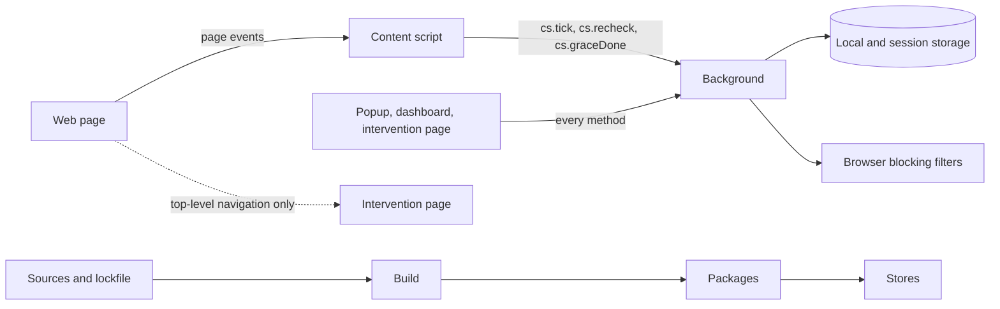

# Threat model

Last reviewed: 2026-10-08

What can go wrong with WebHandbrake, what the code does about it, and what it leaves open. The
[requirements](requirements.md) state the behaviour that this document relies on; the
[glossary](glossary.md) maps the interface terms to the code.

## Scope and review

The model covers the extension (its background, its content script and its pages), the build and
the release. It follows the four questions of threat modelling
([OWASP](https://owasp.org/www-community/Threat_Modeling),
[Threat Modeling Manifesto](https://www.threatmodelingmanifesto.org/)): what are we working on,
what can go wrong, what are we doing about it, and did we do a good job.

Review it, and update the date above, when a change adds a permission, a message method, a
storage key, a web-accessible resource or a new way to change the configuration, and before each
release ([release checklist](releasing.md#release-checklist)).

## Assets

- **The integrity of enforcement**: the rules, the settings, the protection state (levels,
  pending changes, focus sessions, breaks and accesses, cool-downs, the emergency exit) and the
  trusted clock. Changing them without paying the cost that the protection level asks defeats the
  product.
- **The settings password**, stored as a hash ([SEC-01](requirements.md#sec-01)).
- **Personal data on the device**: statistics per rule and per host, saved pages (addresses and
  titles), intentions and break reasons, the decision log with full addresses (in session
  storage), and the automatic backups, which hold the whole configuration including the password
  hash.
- **The build and the release**: the sources, the dependencies, the CI and, for publishing, the
  store accounts. No store account exists and nothing is published.

## Adversaries

- **A hostile web page**: any site the person visits, including one that tries to detect, frame or
  message the extension.
- **A compromised renderer or content script**: a page that has taken over the content script's
  context in its own tab.
- **Another extension** installed in the same browser.
- **A malicious file or list** that the person imports.
- **The supply chain and CI**: a dependency, a GitHub Action or a build step that is not what it
  claims.
- **A store-account takeover**, once the extension is published.
- **A person with access to the browser profile**, the person themselves included, who can read
  and change files on the device.
- **The person's own impulse**, the adversary the product is designed for. The goal against it is
  bounded: getting around a rule must cost more than the impulse is worth
  ([Circumvention routes](#circumvention-routes)).

## Trust boundaries

The background is the only authority. It accepts a message only with the WebHandbrake envelope,
only from this extension (`sender.id`), and, for every method except `cs.tick`, `cs.recheck` and
`cs.graceDone`, only from an extension page (the origin of `sender.url`); there is no
`onMessageExternal` and no `externally_connectable` (`onMessage()` in
`src/background/messages.ts`). The content script runs inside web pages and is treated as
possibly compromised: it can call only those three methods. The extension pages (the popup, the
dashboard and the intervention page) can call every method, but every cost and every change is
decided in the background. The intervention page is web-accessible from every site, because the
browser blocking filters redirect to it; it refuses to render inside a frame
(`src/intervention/index.tsx`). The extension pages run under the content security policy
<!-- fact: manifest.csp|code -->`script-src 'self'; object-src 'none'; base-uri 'none'; form-action 'none'; img-src 'self' data:; style-src 'self'; connect-src 'self'`<!-- /fact -->.
The on-page overlay lives in a closed shadow root
(`src/content/overlay.ts`; the test build opens it). Storage is reachable from the background and
the extension pages only. The build turns the sources and the lockfile into the packages that the
stores receive ([ADR 0011](adr/0011-auditable-build.md)).

## Threats and mitigations

| Threat | Mitigation | Where | Verified by |
|---|---|---|---|
| A web page or another extension sends messages to the background | Envelope, sender and origin checks; a method list for content scripts; no external messaging | `src/background/messages.ts` | [SEC-05](requirements.md#sec-05) |
| A compromised content script calls the background | It may call only the three content-script methods; the background decides everything else | `src/background/messages.ts` | [SEC-05](requirements.md#sec-05) |
| A web page frames the intervention page to trick a click | The page renders only as the top-level document | `src/intervention/index.tsx` | [SEC-08](requirements.md#sec-08) |
| Skipping a cost by editing or scripting an extension page | Costs are tickets kept in the background; waits are timed there, answers and passwords are checked there, and every change goes through `proposeConfig()` | `src/background/tickets.ts`, `src/background/protection.ts` | [PRO-14](requirements.md#pro-14), [SEC-07](requirements.md#sec-07) |
| Guessing the settings password | A PBKDF2-SHA256 hash with many iterations and a random salt, a constant-time comparison, and a short lock after repeated wrong answers | `src/background/crypto.ts`, `src/background/tickets.ts` | [SEC-01](requirements.md#sec-01), [SEC-07](requirements.md#sec-07) |
| A malicious import | A size limit, normalisation that drops invalid entries and unsafe regular expressions, no HTML; an import is a protected change | `src/background/data.ts`, `src/engine/schema.ts` | [SEC-04](requirements.md#sec-04), [PRO-12](requirements.md#pro-12) |
| A regular expression that takes too long to evaluate | A length limit and a refusal of back-references, lookarounds and nested unbounded quantifiers; the nesting test is a heuristic | `checkRegex()` in `src/engine/patterns.ts` | [SEC-03](requirements.md#sec-03) |
| Remote or injected code in extension pages | A strict content security policy ([Trust boundaries](#trust-boundaries)); no remote resources; custom CSS cannot load anything | `scripts/manifest.mjs`, `sanitizeCss()` in `src/background/intervention.ts` | [SEC-02](requirements.md#sec-02), [PRIV-06](requirements.md#priv-06) |
| Test entry points (a movable clock, state access) in a package | A separate test build; the production build leaves the test code out at compile time and fails if it finds it | `scripts/build.mjs` | the guard in `scripts/build.mjs` ([ADR 0011](adr/0011-auditable-build.md)) |
| Damaged storage | A checksum over the stored configuration, restore from the newest valid backup, a `state-restored` event. The checksum (FNV-1a, unkeyed) detects corruption, not deliberate edits | `src/background/store.ts`, `src/engine/schema.ts` | [DAT-03](requirements.md#dat-03) |
| A manipulated system clock | See [CIR-06](#cir-06) | `src/background/clock.ts` | [SCH-07](requirements.md#sch-07) |
| A page reads or changes the overlay | A closed shadow root with its own styles | `src/content/overlay.ts` | review of `src/content/overlay.ts` |
| A malicious dependency or Action | One runtime dependency, a lockfile, `npm ci` in CI, Dependabot for npm packages and Actions | `package.json`, `package-lock.json`, `.github/dependabot.yml`, `.github/workflows/ci.yml` | [SEC-06](requirements.md#sec-06) |
| Browsing data leaves the device | No network request of its own; statistics without addresses | `src/background/accounting.ts` | [PRIV-01](requirements.md#priv-01), [STA-07](requirements.md#sta-07) |

## Residual risks

- **Detectability on Chrome.** Any site can tell that WebHandbrake is installed by loading its
  web-accessible intervention page, whose address uses the fixed extension ID; `use_dynamic_url`
  is not adopted ([roadmap candidate](roadmap.md#candidates)). Firefox gives each installation its
  own random address for extension pages.
- **Data at rest is not encrypted.** Anyone with the browser profile can read the statistics, the
  saved pages, the intentions and break reasons, the backups and, while the browser runs, the
  decision log.
- **Offline password guessing.** Someone with the profile can copy the password hash, which is also
  in every automatic backup, and test passwords offline; the iterations slow this down but do not
  prevent it.
- **Falsified activity.** A compromised renderer can send false activity ticks for its own tab,
  and so add or withhold counted time for that tab.
- **Typed challenges and developer tools.** The text of a random code is sent to the page that
  draws it, so developer tools on that page can read it and answer it
  ([CIR-07](#cir-07)).
- **Store accounts.** No store account exists. Once publishing starts, accounts held by one person
  are a single point of failure unless a second trusted person also has access.
- **GitHub Actions by tag.** The workflows reference GitHub's own Actions by version tag, not by
  commit; only the link-check Action is pinned to a commit.
- **Backups cannot be deleted.** Automatic backups keep the whole configuration, the password hash
  included; nothing deletes them except rotation and uninstalling, and they survive Reset and the
  emergency exit ([roadmap candidate](roadmap.md#candidates)).

## Circumvention routes

No extension can stop someone in full control of their device. The aim is to make getting around
a rule cost more than the impulse, and to say plainly where WebHandbrake stops. Stronger measures,
such as browser policies set up by the person, stay their deliberate and reversible choice.
"Protected" below means the conditions under which the browser pages of
[PRO-08](requirements.md#pro-08) are blocked: always in the mode "always"; in the automatic mode,
while a focus session that cannot be interrupted runs or while a rule at Strict or Locked
restricts browsing.

Statuses: **in place** (the route is closed as described), **partial** (some ways remain open),
**none** (nothing stops it), **out of scope** (outside what an extension can do), **not verified**
(unknown).

| ID | Route | What WebHandbrake does | Status | Verified by | Help topic |
|---|---|---|---|---|---|
| CIR-01 | Turning off or uninstalling the extension | While protected, the browser's extension and settings pages are blocked, except while a break runs when **Breaks also unlock these pages** is on. A start after a long time without the extension running (`INACTIVE_GAP_MS` in `src/engine/limits.ts`) is recorded as an event. The toolbar's own menus can still remove the extension, nothing works on Firefox for Android or for pages opened from the command line, and uninstalling cannot be prevented. | partial | [PRO-08](requirements.md#pro-08), [PRO-13](requirements.md#pro-13) | [What WebHandbrake cannot do](user-guide.md#what-webhandbrake-cannot-do) |
| CIR-02 | Private windows | WebHandbrake runs there only if the person allows it. First run, Today and Protection say when it is not allowed, and removing that access is recorded as an event. | partial | [PRO-09](requirements.md#pro-09) | [Troubleshooting](user-guide.md#troubleshooting) |
| CIR-03 | Another browser | Nothing: an extension cannot act there. | out of scope | — | [What WebHandbrake cannot do](user-guide.md#what-webhandbrake-cannot-do) |
| CIR-04 | A new profile or guest mode | While protected, `about:profiles` and the Chrome-family settings pages are blocked; the profile and guest menus remain open. The checklist mentions it. | partial | [PRO-08](requirements.md#pro-08), [PRO-18](requirements.md#pro-18) | [What WebHandbrake cannot do](user-guide.md#what-webhandbrake-cannot-do) |
| CIR-05 | Firefox Troubleshoot Mode | While protected, `about:support` is blocked; the Help menu and holding Shift at start-up remain. The checklist mentions it. | partial | [PRO-08](requirements.md#pro-08), [PRO-18](requirements.md#pro-18) | [What WebHandbrake cannot do](user-guide.md#what-webhandbrake-cannot-do) |
| CIR-06 | Changing the system clock | Time never goes back: a clock set back is detected and ignored. A clock set forward is corrected from the Date header of pages the browser loads, once at least <!-- fact: limits.CLOCK_MIN_AGREEING_HOSTS -->3<!-- /fact --> hosts agree, and only with **Detect a manipulated system clock** on (turning it off is a loosening). Until enough hosts have answered, the clock is trusted. | partial | [SCH-07](requirements.md#sch-07) | [Protection levels](user-guide.md#protection-levels) |
| CIR-07 | Developer tools | Editing an extension page unlocks nothing, because the background decides every cost and change, and waits cannot be shortened. Developer tools on an intervention page can read the text of a random code and submit it. In Chrome, `chrome://inspect` is not blocked and opens the background itself, whose console can change storage ([CIR-08](#cir-08)). | partial | [PRO-14](requirements.md#pro-14) | — |
| CIR-08 | Editing the stored data | While protected, `about:debugging` and the extension pages are blocked; `chrome://inspect` is not. The checksum detects damage, not a deliberate edit, which anyone can make consistent. | partial | [DAT-03](requirements.md#dat-03), [PRO-08](requirements.md#pro-08) | — |
| CIR-09 | Reinstalling to start afresh | Nothing: uninstalling deletes every rule, setting and backup. | none | — | [What WebHandbrake cannot do](user-guide.md#what-webhandbrake-cannot-do) |
| CIR-10 | Importing a looser configuration | An import is classified like any change, so what it loosens follows the protection level. | in place | [PRO-12](requirements.md#pro-12) | [Your data](user-guide.md#your-data) |
| CIR-11 | Reordering rules | The most severe result wins whatever the order. | in place | [SEM-03](requirements.md#sem-03) | — |
| CIR-12 | Copying the challenge from the page | A random code is drawn on a canvas, not written in the page. | in place | [INT-04](requirements.md#int-04) | — |
| CIR-13 | Pasting into the challenge | Pasting and synthetic input are refused. | in place | [INT-04](requirements.md#int-04) | — |
| CIR-14 | Mirrors, proxies and alternative front ends | Ready-made lists include alternative domains; there are no curated lists of mirrors. | partial | [MAT-14](requirements.md#mat-14) | — |
| CIR-15 | The site embedded in another page | A rule can also block its sites in frames of other pages. | in place | [MAT-13](requirements.md#mat-13) | [Rules and sites](user-guide.md#rules-and-sites) |
| CIR-16 | The back button and the back-forward cache | Restored pages are checked again. | in place | [ENF-10](requirements.md#enf-10) | — |
| CIR-17 | Navigation inside a single-page app | History API navigations are checked. | in place | [ENF-03](requirements.md#enf-03) | — |
| CIR-18 | Copying the address from the intervention page | The page can hide the address, but the intervention page's own address still contains it. | partial | [INT-01](requirements.md#int-01) | — |
| CIR-19 | Changing the time zone | Nothing: schedules follow local time, and a change of time zone is not detected. | none | [SCH-06](requirements.md#sch-06) | [What WebHandbrake cannot do](user-guide.md#what-webhandbrake-cannot-do) |
| CIR-20 | Revoking access to sites | Blocking falls back to network blocks, a warning appears and an event is recorded. | in place | [ENF-12](requirements.md#enf-12) | [Troubleshooting](user-guide.md#troubleshooting) |
| CIR-21 | Reader view and `view-source:` | The page they show is evaluated. | in place | [TIM-06](requirements.md#tim-06) | — |
| CIR-22 | Installed web apps and widgets | Unknown: no test opens an installed web app. | not verified | — | — |
| CIR-23 | Other devices and native apps | Nothing: they are outside the browser. | out of scope | — | [What WebHandbrake cannot do](user-guide.md#what-webhandbrake-cannot-do) |
| CIR-24 | Many tabs, or tabs in the background | Time is counted in the background, at most one second per real second, and background tabs count only if the person chooses so. | in place | [TIM-03](requirements.md#tim-03) | — |
| CIR-25 | Loosening rules in the dashboard | Loosening follows the protection level: a confirmation, a wait, a cooling-off or a refusal. | in place | [PRO-01](requirements.md#pro-01), [PRO-02](requirements.md#pro-02), [PRO-03](requirements.md#pro-03) | [Protection levels](user-guide.md#protection-levels) |
| CIR-26 | Turning off, archiving or deleting a rule | Classified as a loosening while the rule is active. | in place | [PRO-02](requirements.md#pro-02) | — |
| CIR-27 | Deleting statistics to refill a limit | The totals that limits need are kept. | in place | [STA-06](requirements.md#sta-06) | [Your data](user-guide.md#your-data) |
| CIR-28 | Changing the start of the day, inactivity or tracking settings | Settings that the classifier does not list as neutral count as loosening, such as **Days start at**. Lowering the inactivity time counts less time, yet it is classified as stricter and applies at once. | partial | [PRO-02](requirements.md#pro-02) | — |
| CIR-29 | Taking break after break | Breaks are limited per rule and overall, and their costs are checked in the background. | in place | [BRK-04](requirements.md#brk-04), [BRK-05](requirements.md#brk-05) | [Breaks](user-guide.md#breaks) |
| CIR-30 | Variants of an address (case, punycode, a trailing dot, `www`, `http` or `https`) | Addresses and entries are normalised before matching. | in place | [MAT-02](requirements.md#mat-02) | — |

## Vulnerability or design limit

A **vulnerability** lets a web page, a file, another extension or someone without control of the
device get around enforcement, run code in the extension or read its data: report it through
[the security policy](../SECURITY.md). A **design limit** needs control of the device or of the
browser profile, as in CIR-03, CIR-09, CIR-19 and CIR-23, or the partial routes above that need
the browser's own menus, developer tools or files. Design limits are listed here and in the user
guide, not fixed as vulnerabilities.
